# Floating Origin System Architecture

> **Project**: 3D Space Shooter Tutorial  
> **Unity Version**: 6000.3  
> **Status**: Phase 1 Complete, Refactoring to Registration-Based Architecture

---

## Table of Contents

1. [Overview](#overview)
2. [The Problem](#the-problem)
3. [The Solution](#the-solution)
4. [System Architecture](#system-architecture)
5. [Component Roles](#component-roles)
6. [Shift Flow](#shift-flow)
7. [Single-Player vs Multiplayer](#single-player-vs-multiplayer)
8. [Data Flow](#data-flow)
9. [Registration Lifecycle](#registration-lifecycle)

---

## Overview

The Floating Origin System prevents floating-point precision degradation by periodically shifting the entire game world to keep the player (or average player position in multiplayer) near the world origin (0, 0, 0).

### Key Principles

- **Everything moves together** - Player, enemies, asteroids, effects all shift by the same offset
- **Spatial relationships preserved** - Relative positions between objects remain unchanged
- **Registration-based** - Objects explicitly opt-in to participate in shifts
- **Event-driven** - Integrates with EventBus for loose coupling
- **Multiplayer-ready** - Supports centroid-based shifting for multiple players

---

## The Problem

### Floating-Point Precision Loss

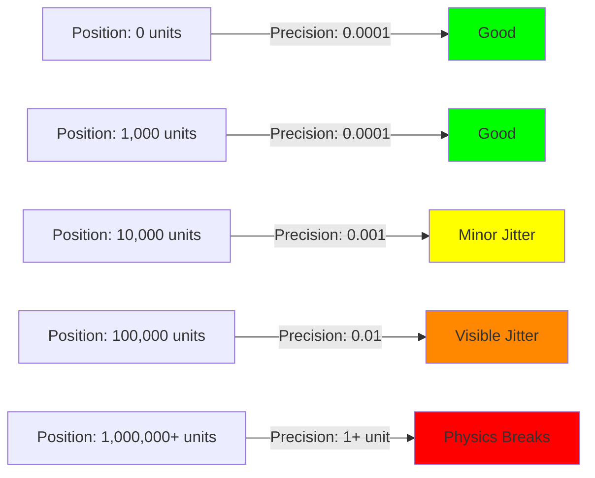

### Symptoms

- Camera shake/judder when far from origin
- Ship jittering during movement
- Physics glitches (collisions miss, rigidbodies vibrate)
- Particle effects stutter
- Trail renderers break or snap

---

## The Solution

### Core Concept

When the reference point (player or centroid of players) exceeds a threshold distance from origin, shift the entire world back.

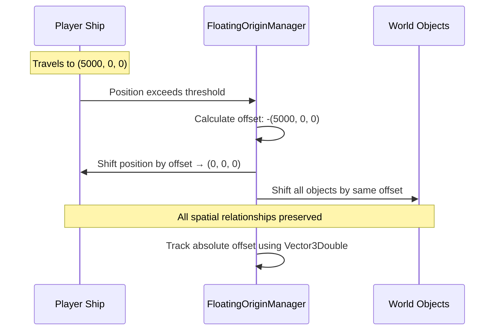

### Before and After Shift

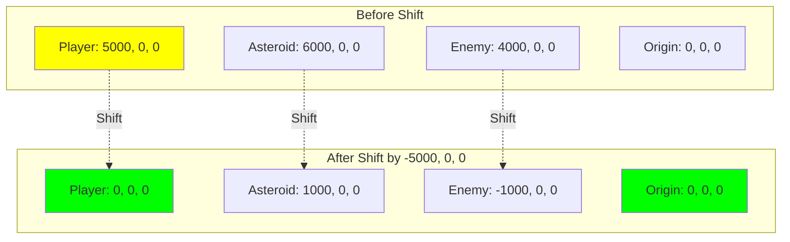

---

## System Architecture

### Component Hierarchy

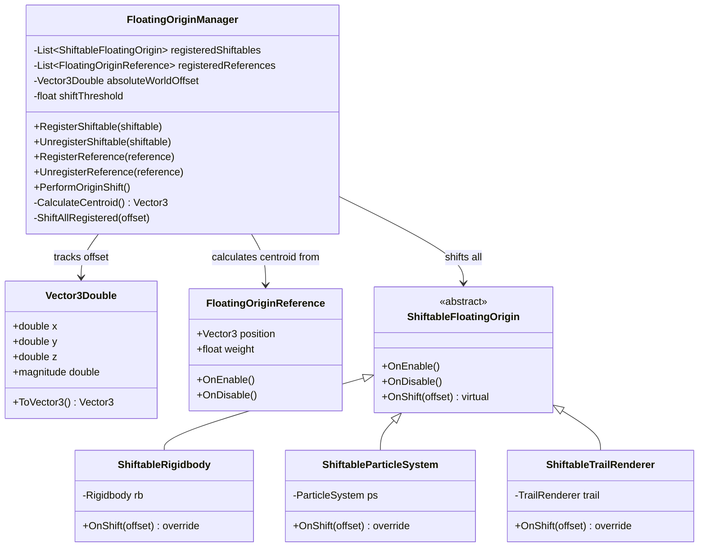

---

## Component Roles

### FloatingOriginManager (Singleton)

**Responsibility**: Orchestrates the entire floating origin system

- Maintains registration lists for references and shiftables
- Calculates centroid from all reference positions
- Detects when shift threshold is exceeded
- Performs the actual shift operation
- Raises `OriginShiftedEvent` via EventBus
- Tracks absolute world offset using `Vector3Double`

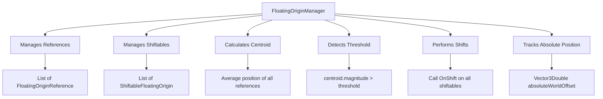

### FloatingOriginReference

**Responsibility**: "I influence WHEN to shift"

- Registers with manager on `OnEnable()`
- Unregisters on `OnDisable()`
- Provides position for centroid calculation
- Optional weight property for weighted averaging (multiplayer)

**Used By**:
- Player ship (single-player and multiplayer)
- AI-controlled reference points (optional)

### ShiftableFloatingOrigin (Base Class)

**Responsibility**: "I need to BE shifted when shift happens"

- Abstract base class for all shiftable objects
- Registers with manager on `OnEnable()`
- Unregisters on `OnDisable()`
- Virtual `OnShift(Vector3 offset)` method with default implementation
- Default behavior: `transform.position += offset`

### ShiftableRigidbody

**Responsibility**: "Shift my physics-simulated body correctly"

- Extends `ShiftableFloatingOrigin`
- Overrides `OnShift()` to use `Rigidbody.position` instead of `transform.position`
- Preserves velocity and angular velocity during shift
- Prevents physics glitches

**Used By**:
- Player ship (has Rigidbody)
- Asteroids (have Rigidbody)
- Projectiles (have Rigidbody)
- Enemies (have Rigidbody)

### ShiftableParticleSystem

**Responsibility**: "Shift my particles in world space"

- Extends `ShiftableFloatingOrigin`
- Shifts both transform and particle positions
- Handles world-space particle systems correctly

**Used By**:
- Explosions
- Engine trails
- Weapon effects

### ShiftableTrailRenderer

**Responsibility**: "Clear my trail during shift to prevent snapping"

- Extends `ShiftableFloatingOrigin`
- Shifts transform
- Clears trail to prevent visual artifacts

**Used By**:
- Projectile trails
- Ship engine trails
- Movement indicators

---

## Shift Flow

### Complete Shift Sequence

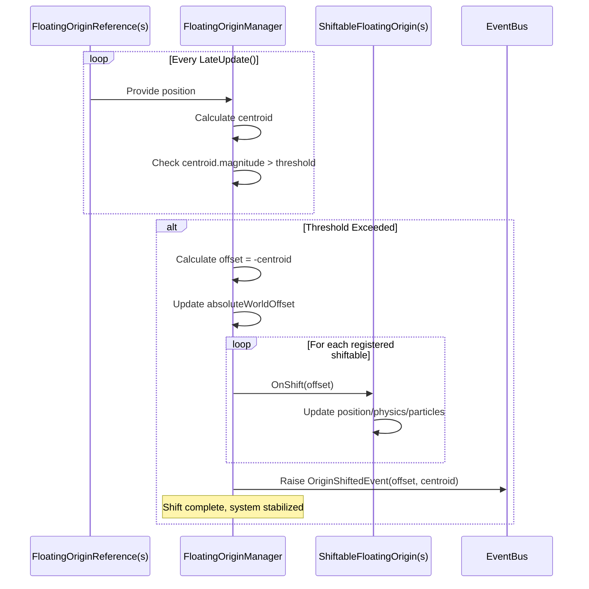

### Why The Player Needs Both Components

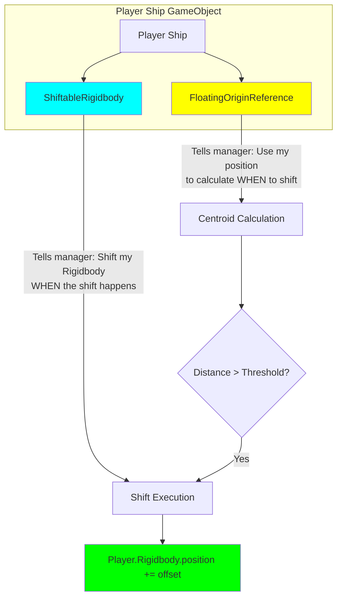

**Key Point**: The player doesn't stay at origin while the world moves. Instead, the player moves WITH the world, and the shift is calculated to make the player END UP near the origin.

---

## Single-Player vs Multiplayer

### Single-Player Architecture

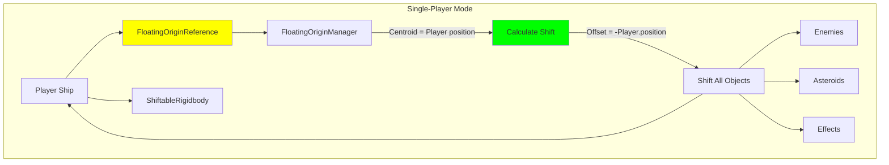

**Single Reference**: Only the player ship has `FloatingOriginReference`  
**Centroid**: Equals the player's position  
**Result**: Player stays near origin

### Multiplayer Architecture

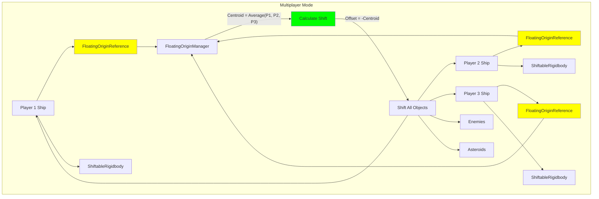

**Multiple References**: All player ships have `FloatingOriginReference`  
**Centroid**: Average position of all players  
**Result**: Centroid stays near origin

**Natural Balancing**: Players in opposite directions naturally balance out:
- Player at (10000, 0, 0)
- Player at (-10000, 0, 0)
- Centroid: (0, 0, 0) → No shift needed!

---

## Data Flow

### Registration Flow

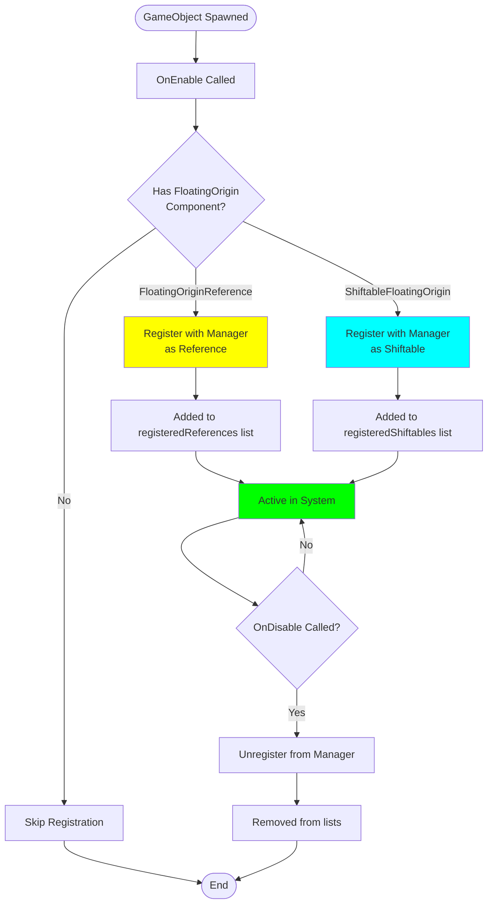

### Shift Calculation Flow

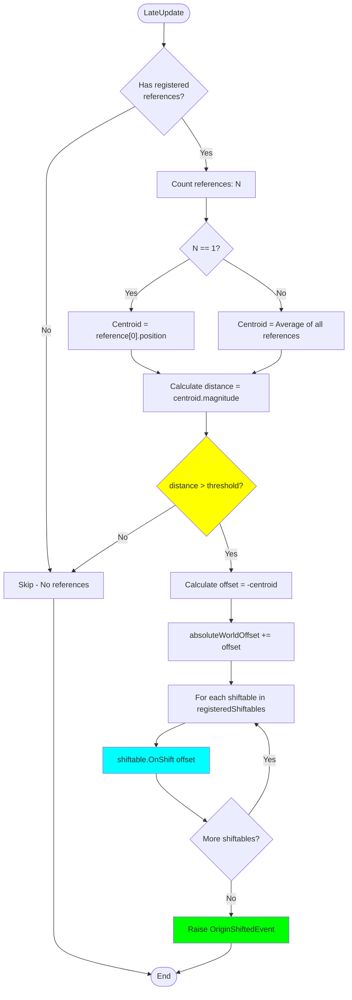

---

## Registration Lifecycle

### Component Lifecycle Diagram

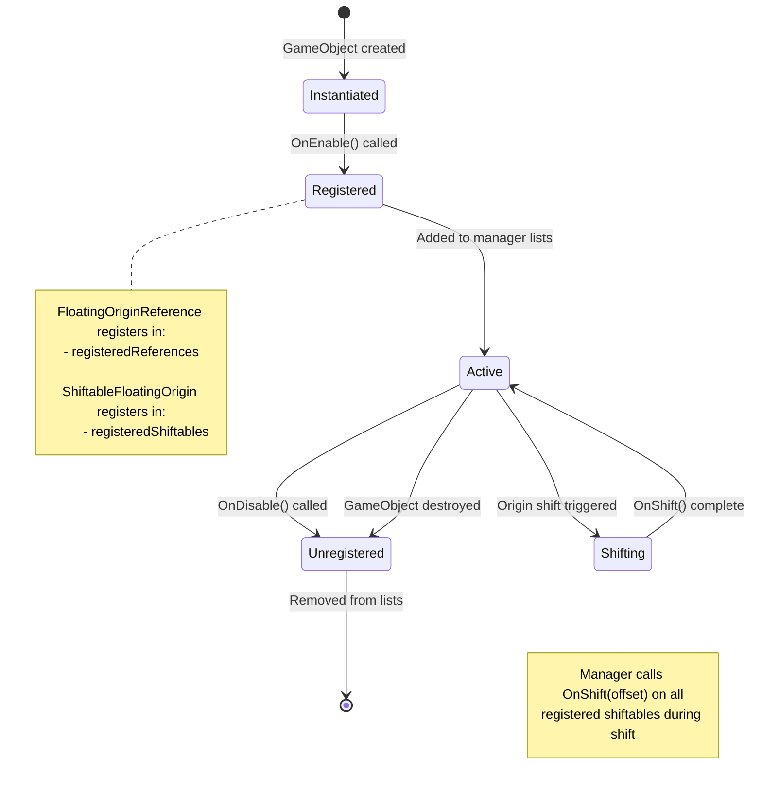

### Example: Player Ship Lifecycle

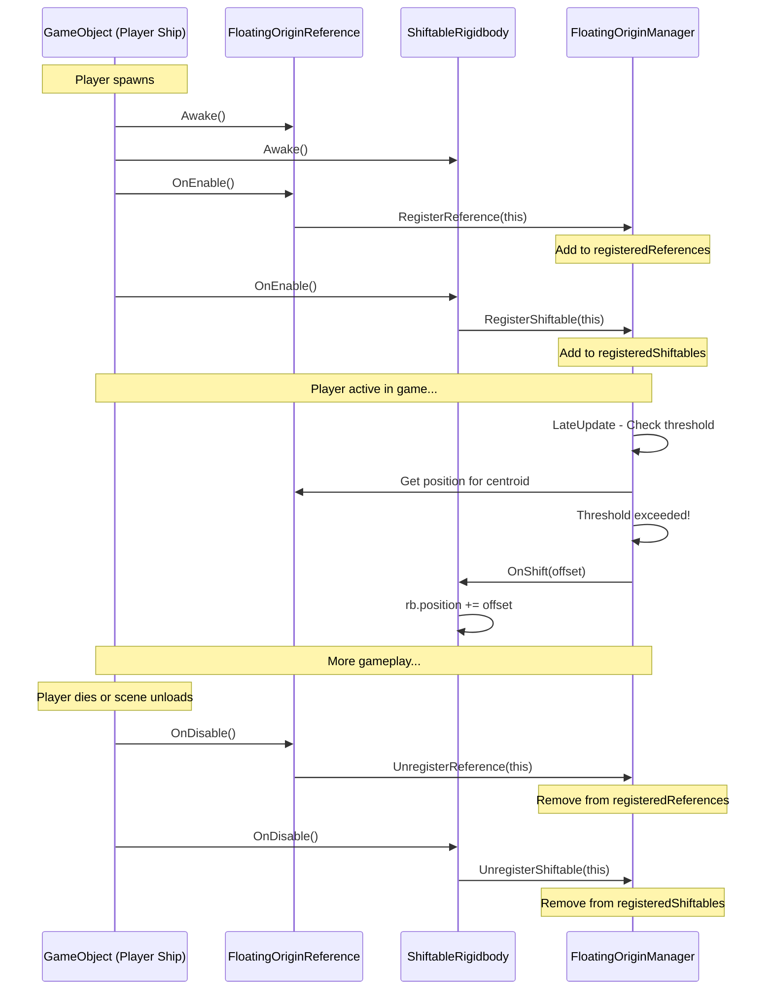

---

## Performance Considerations

### Why Registration-Based Is Efficient

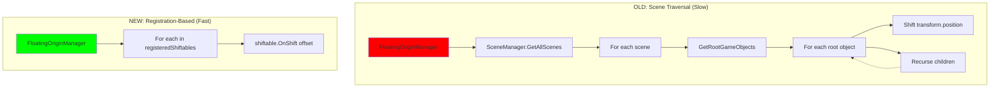

**Old Approach**: O(n) where n = total GameObjects in scene  
**New Approach**: O(m) where m = registered shiftables (typically << n)

### Typical Registration Counts

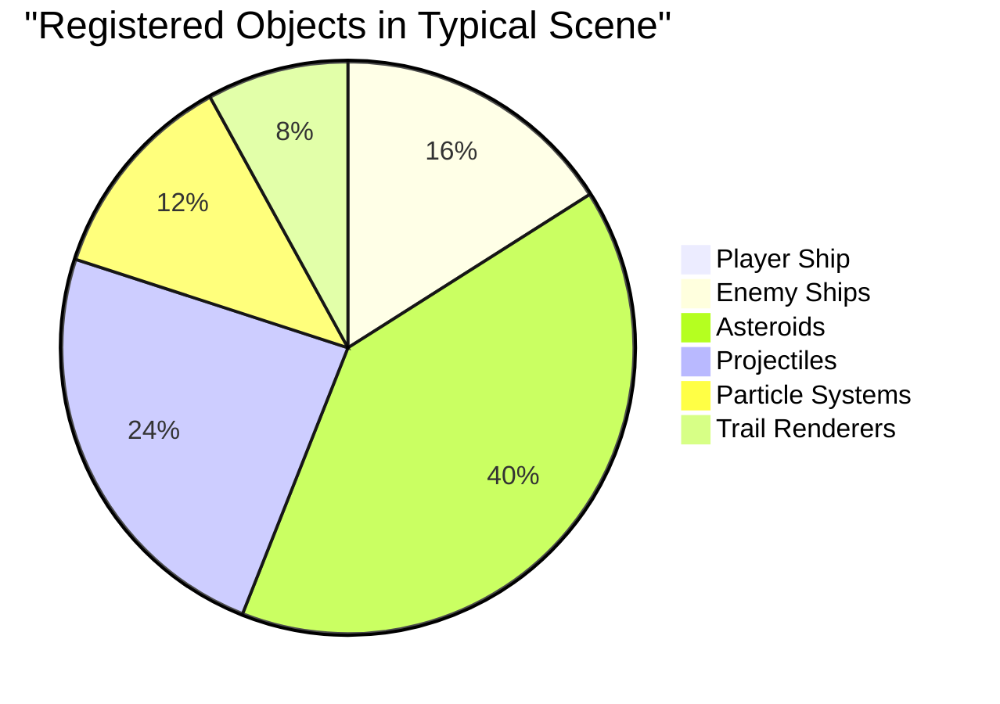

**Total**: ~126 objects vs. potentially thousands of GameObjects in scene

---

## Integration Points

### EventBus Integration

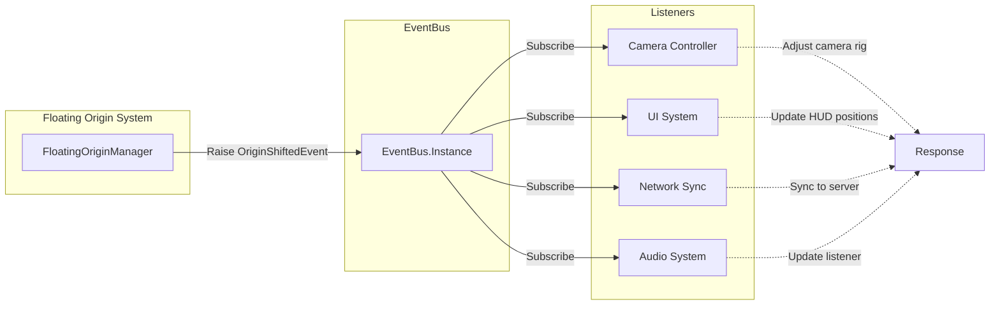

### Example Event Listener

```csharp
using MidniteOilSoftware.Core;
using MidniteOilSoftware.SpaceShooter.Events;

void OnEnable()
{
    EventBus.Instance.Subscribe<OriginShiftedEvent>(OnOriginShifted);
}

void OnDisable()
{
    EventBus.Instance?.Unsubscribe<OriginShiftedEvent>(OnOriginShifted);
}

void OnOriginShifted(OriginShiftedEvent evt)
{
    // evt.Offset - The Vector3 offset applied
    // evt.OldCentroid - The centroid before shift
    // Handle custom shift logic here
}
```

---

## Summary

### Key Takeaways

1. **Both components needed**: Player needs `FloatingOriginReference` (trigger) and `ShiftableRigidbody` (response)
2. **Everything shifts together**: Player doesn't stay still - entire world shifts including player
3. **Registration-based**: Explicit opt-in prevents performance issues
4. **Event-driven**: Loose coupling via EventBus for extensibility
5. **Multiplayer-ready**: Centroid-based approach handles multiple players naturally

### Architecture Benefits

- ✅ No scene traversal required
- ✅ Automatic lifecycle management via OnEnable/OnDisable
- ✅ Type-safe component specialization
- ✅ Extensible via inheritance
- ✅ Testable and debuggable
- ✅ Multiplayer-compatible from the start

---

*Generated for 3D Space Shooter Tutorial - Unity 6000.3*
