# Multiplayer Architecture Diagrams

Visual reference for the multiplayer architecture design.

**Updated**: Edgegap hosting with username/password authentication

---

## Network Variables Strategy

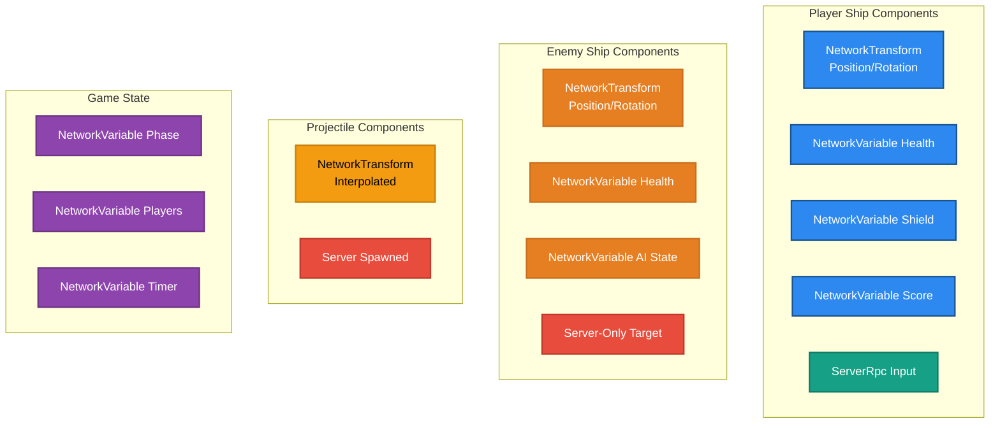

**Legend**:

- 🔵 Blue: Player-owned components
- 🟢 Teal: Client-to-server RPCs
- 🟠 Orange: Enemy components (server-controlled)
- 🔴 Red: Server-only logic
- 🟡 Yellow: Projectile components
- 🟣 Purple: Game state components

---

## Scene Architecture

**Client Build** (2 scenes):
- `Login` scene - Authentication UI (client-only, excluded from server build)
- `Main` scene - Game scene with multiplayer gameplay

**Server Build** (1 scene):
- `Main` scene only - Game scene (no Login scene)

**Build Profile Configuration**:
- Login scene is excluded from Dedicated Server build profile
- Server boots directly into Main scene
- Clients boot into Login scene, then load Main after authentication

---

## Authentication Flow (Username/Password)

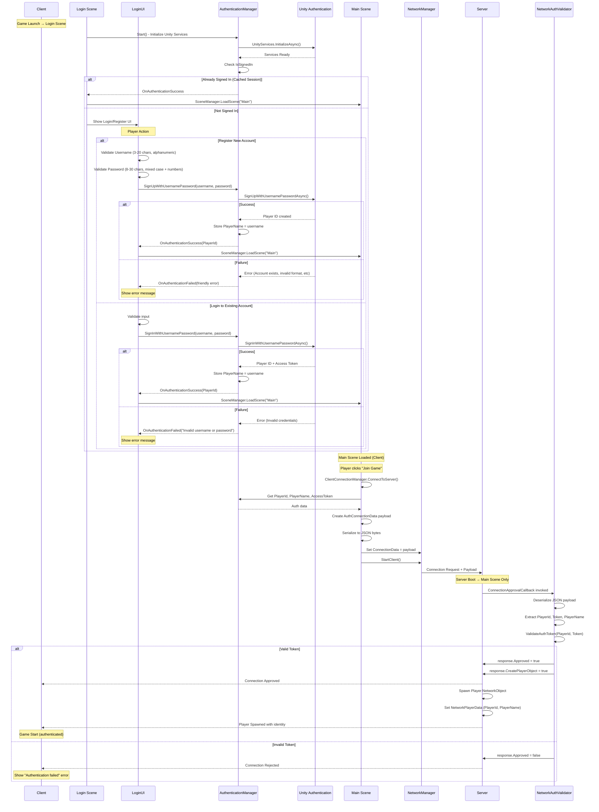

**Key Features**:

- **Dedicated Login Scene**: Separate scene for authentication (client-only)
- **Build Profile Separation**: Login scene excluded from server build
- **Session Persistence**: Auto-login on subsequent launches
- **Client-side Validation**: Username/password format checked before sending
- **Server-side Validation**: Token validated on connection approval
- **User-Friendly Errors**: Friendly error messages for all failure cases
- **Secure**: Access token never exposed to client code (internal to Unity Auth SDK)

---

## Multiplayer Data Flow

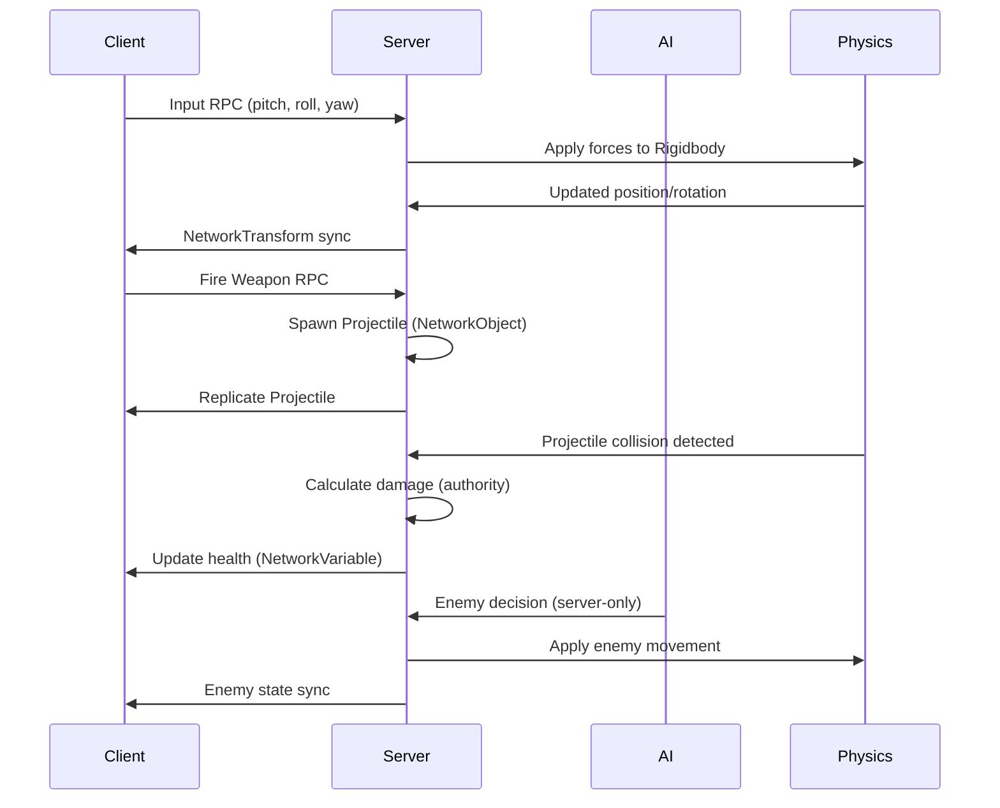

---

## Component Migration Flow

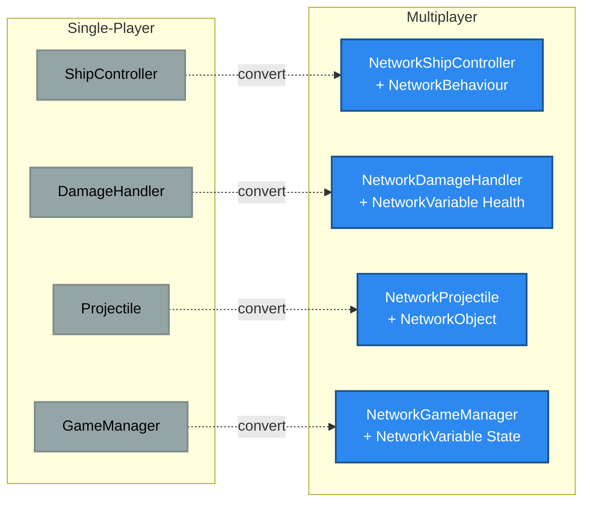

---

## Player Spawning Architecture

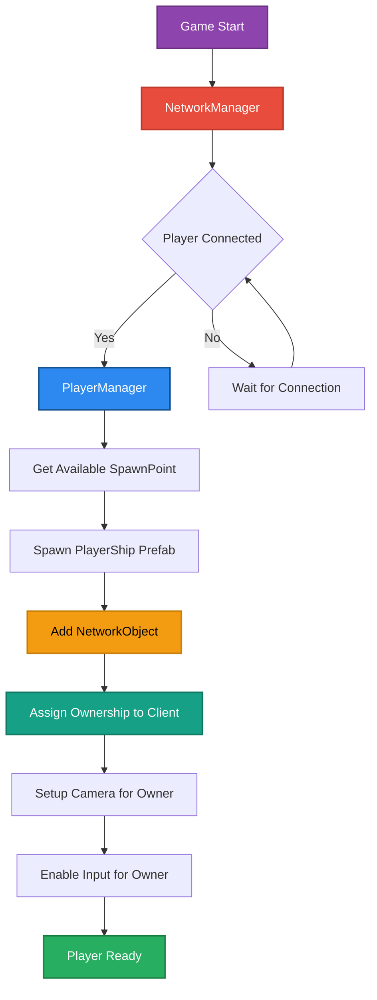

---

## Weapon System Data Flow

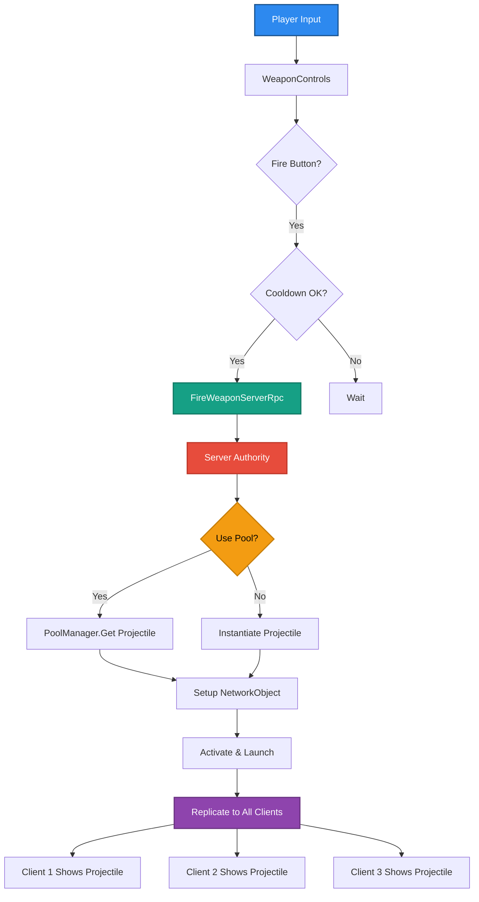

---

## Damage Calculation Authority

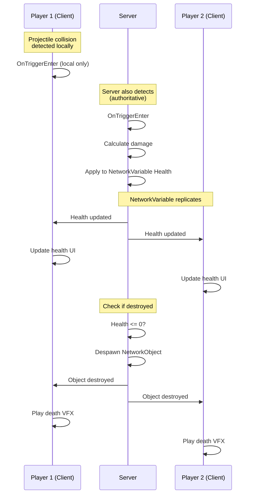

---

## Enemy AI Synchronization

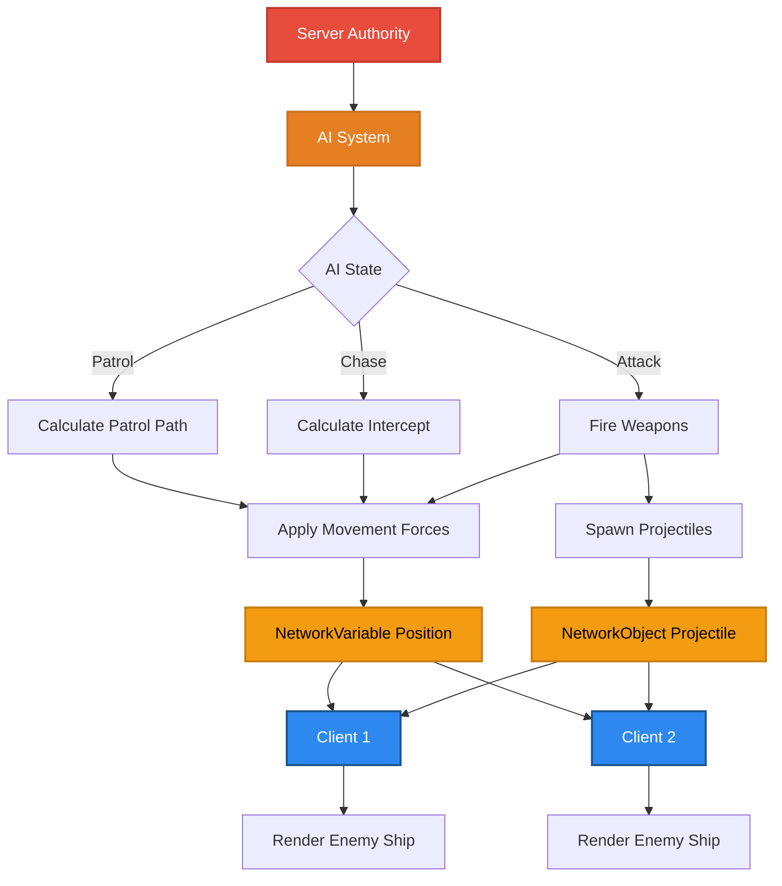

---

## Complete Player Flow (Authentication → Matchmaking → Game)

```mermaid
graph TD
    Start[Player Launches Game<br/>Client-Only] --> LoadLogin[Load Login Scene]
    LoadLogin --> Init[AuthenticationManager.Start]
    Init --> InitServices[UnityServices.InitializeAsync]
    InitServices --> CheckCache{IsSignedIn?}
    
    CheckCache -->|Yes| AutoLogin[Load Cached Session]
    AutoLogin --> LoadMain[SceneManager.LoadScene Main]
    
    CheckCache -->|No| LoginUI[Show Login/Register UI]
    
    LoginUI --> UserChoice{User Action}
    UserChoice -->|Login| ValidateLogin[Validate Input Format]
    UserChoice -->|Register| ValidateReg[Validate Username & Password]
    
    ValidateLogin --> Login[SignInWithUsernamePasswordAsync]
    ValidateReg --> Register[SignUpWithUsernamePasswordAsync]
    
    Login --> ValidLogin{Valid?}
    Register --> ValidReg{Valid?}
    
    ValidLogin -->|Yes| StoreSession[Store PlayerId & PlayerName]
    ValidReg -->|Yes| StoreSession
    
    StoreSession --> LoadMain
    
    ValidLogin -->|No| LoginError[Show Friendly Error]
    ValidReg -->|No| RegError[Show Friendly Error]
    
    LoginError --> LoginUI
    RegError --> LoginUI
    
    LoadMain --> MainScene[Main Scene Loaded]
    MainScene --> FindMatch[Click Find Match/Join Game]
    FindMatch --> Arbiter[Edgegap Arbiter Matchmaking]
    
    Arbiter --> Check{Server Available?}
    Check -->|No| Provision[Provision New Server Container]
    Check -->|Yes| Assign[Assign to Existing Server]
    
    Provision --> Docker[Build Docker Container]
    Docker --> Edge[Deploy to Nearest Edge Node]
    Edge --> Ready[Server Ready & Listening]
    
    Assign --> Ready
    
    Ready --> CreatePayload[Create Auth Payload<br/>PlayerId, Token, PlayerName]
    CreatePayload --> Serialize[Serialize to JSON bytes]
    Serialize --> SetData[Set NetworkConfig.ConnectionData]
    SetData --> Connect[StartClient]
    
    Connect --> ServerReceive[Server Receives Connection]
    ServerReceive --> Callback[ConnectionApprovalCallback]
    Callback --> Deserialize[Deserialize Payload]
    Deserialize --> Validate[ValidateAuthToken]
    
    Validate --> Approved{Valid Token?}
    Approved -->|Yes| CreatePlayer[CreatePlayerObject = true]
    Approved -->|No| Reject[Approved = false]
    
    CreatePlayer --> SpawnPlayer[Spawn Player NetworkObject]
    SpawnPlayer --> SetIdentity[Set NetworkPlayerData<br/>PlayerId + PlayerName]
    SetIdentity --> GameStart[Game Start - Authenticated]
    
    Reject --> ShowError[Connection Rejected]
    ShowError --> MainScene
    
    GameStart --> Playing[Player In Game]
    Playing --> Disconnect{Player Leaves?}
    Disconnect -->|Yes| Cleanup[Despawn Player]
    Disconnect -->|No| Playing
    
    Cleanup --> CheckEmpty{Server Empty?}
    CheckEmpty -->|Yes| Shutdown[Arbiter Shuts Down Server]
    CheckEmpty -->|No| WaitPlayers[Wait for More Players]
    
    Shutdown --> Done[Server Terminated]
    
    style Start fill:#8e44ad,stroke:#6c3483,stroke-width:2px,color:#fff
    style LoadLogin fill:#9b59b6,stroke:#7d3c98,stroke-width:2px,color:#fff
    style LoginUI fill:#3498db,stroke:#2980b9,stroke-width:2px,color:#fff
    style Login fill:#16a085,stroke:#117a65,stroke-width:2px,color:#fff
    style Register fill:#16a085,stroke:#117a65,stroke-width:2px,color:#fff
    style LoadMain fill:#9b59b6,stroke:#7d3c98,stroke-width:2px,color:#fff
    style MainScene fill:#2d89ef,stroke:#1a5490,stroke-width:2px,color:#fff
    style Arbiter fill:#e74c3c,stroke:#c0392b,stroke-width:2px,color:#fff
    style Docker fill:#34495e,stroke:#2c3e50,stroke-width:2px,color:#fff
    style Edge fill:#e74c3c,stroke:#c0392b,stroke-width:2px,color:#fff
    style Validate fill:#f39c12,stroke:#c87f0a,stroke-width:2px,color:#000
    style GameStart fill:#27ae60,stroke:#1e8449,stroke-width:2px,color:#fff
    style Reject fill:#e74c3c,stroke:#c0392b,stroke-width:2px,color:#fff
    style Shutdown fill:#95a5a6,stroke:#7f8c8d,stroke-width:2px,color:#000
```

**Architecture Highlights**:

- **Login Scene**: Dedicated client-only scene for authentication (excluded from server build)
- **Build Profile Separation**: Server boots directly to Main scene, clients to Login scene
- **Session Persistence**: Cached login tokens for seamless re-authentication
- **Edgegap Arbiter**: Auto-scaling matchmaking with server lifecycle management
- **Docker Containers**: Servers run in isolated containers deployed to edge nodes
- **Token Validation**: Server-side approval prevents unauthorized connections
- **Auto-Shutdown**: Servers automatically terminate when empty to save costs
- **Edge Deployment**: Servers spawn on nodes closest to players for low latency

---

## Object Pooling with Networking

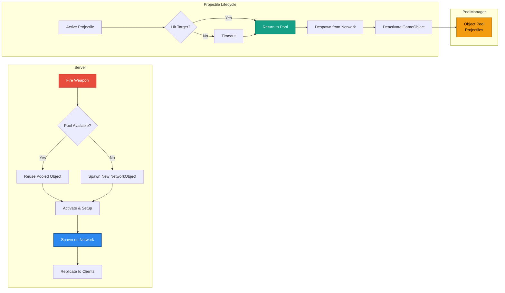

---

## Phase 0 Preparation Dependencies

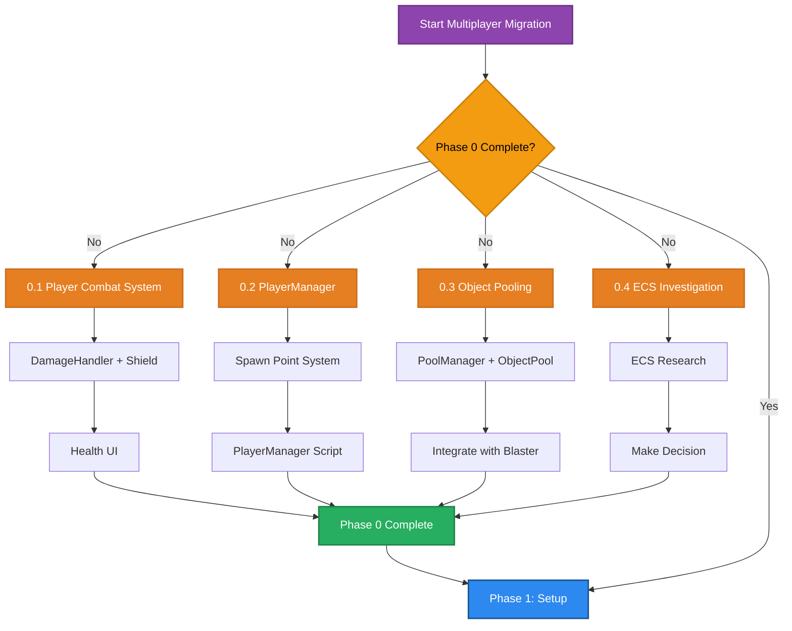

---

## NetworkTransform Configuration

Detailed configuration settings for NetworkTransform component on player ships.

### Authority Configuration

```mermaid
graph TD
    A[NetworkTransform Component] --> B[Authority Settings]
    A --> C[Position Settings]
    A --> D[Rotation Settings]
    A --> E[Scale Settings]
    A --> F[Performance Settings]
    
    B --> B1[Server Authoritative ✓]
    B --> B2[Sync In Local Space ✗]
    
    C --> C1[Sync XYZ ✓]
    C --> C2[Threshold: 0.01m]
    C --> C3[Smooth Dampening ✓]
    
    D --> D1[Sync XYZ ✓]
    D --> D2[Threshold: 0.1°]
    D --> D3[Quaternion Sync ✓]
    D --> D4[Quaternion Compression ✓]
    
    E --> E1[Sync XYZ ✗]
    
    F --> F1[Half Float Precision ✓]
    F --> F2[Tick Sync Children ✗]
    F --> F3[Unreliable Deltas ✗]
    
    style B1 fill:#27ae60,stroke:#1e8449,stroke-width:2px,color:#fff
    style B2 fill:#e74c3c,stroke:#c0392b,stroke-width:2px,color:#fff
    style C3 fill:#27ae60,stroke:#1e8449,stroke-width:2px,color:#fff
    style D3 fill:#27ae60,stroke:#1e8449,stroke-width:2px,color:#fff
    style D4 fill:#27ae60,stroke:#1e8449,stroke-width:2px,color:#fff
    style E1 fill:#e74c3c,stroke:#c0392b,stroke-width:2px,color:#fff
    style F1 fill:#27ae60,stroke:#1e8449,stroke-width:2px,color:#fff
    style F2 fill:#e74c3c,stroke:#c0392b,stroke-width:2px,color:#fff
    style F3 fill:#e74c3c,stroke:#c0392b,stroke-width:2px,color:#fff
```

### Interpolation Options Comparison

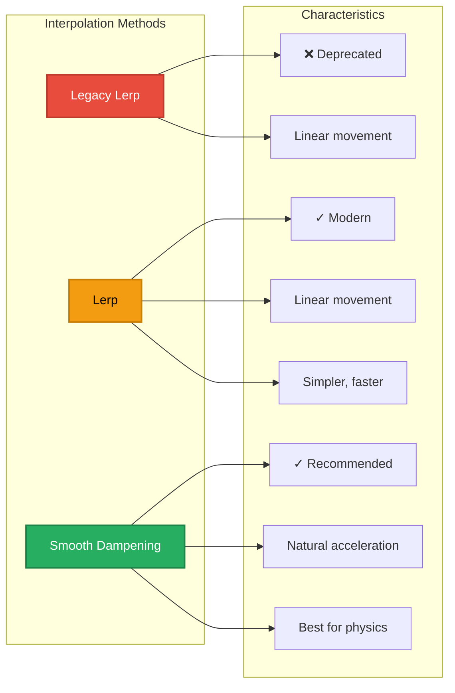

### Bandwidth Optimization

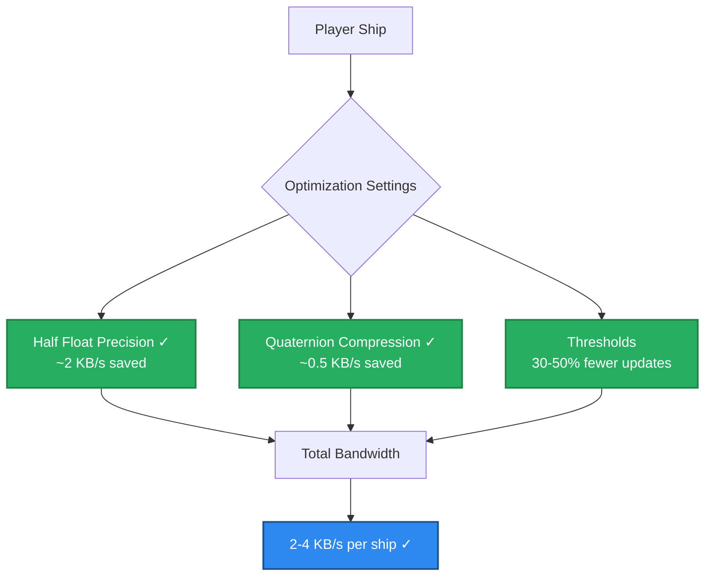

---

## Edgegap Server Lifecycle

```mermaid
graph LR
    subgraph "Arbiter Matchmaking"
        Request[Player Requests Match]
        Request --> Check{Server Available?}
        Check -->|No| Provision[Provision New Server]
        Check -->|Yes| Assign[Assign to Existing]
    end
    
    subgraph "Server Lifecycle"
        Provision --> Build[Build Docker Container]
        Build --> Deploy[Deploy to Edge Node]
        Deploy --> Boot[Server Boots Up]
        Boot --> Listen[Listen for Connections]
        
        Assign --> Listen
        
        Listen --> Players[Accept Players]
        Players --> Active[Server Active]
        
        Active --> Monitor{Players Connected?}
        Monitor -->|Yes| Active
        Monitor -->|No| Idle[Server Idle]
        
        Idle --> Timeout{Idle Timeout?}
        Timeout -->|No| Monitor
        Timeout -->|Yes| Shutdown[Shutdown Server]
        
        Shutdown --> Cleanup[Release Resources]
        Cleanup --> Terminated[Container Terminated]
    end
    
    subgraph "Cost Optimization"
        Terminated --> Save[💰 Stop Billing]
        Active --> Bill[💰 Pay Per Hour]
    end
    
    style Request fill:#3498db,stroke:#2980b9,stroke-width:2px,color:#fff
    style Provision fill:#e74c3c,stroke:#c0392b,stroke-width:2px,color:#fff
    style Build fill:#34495e,stroke:#2c3e50,stroke-width:2px,color:#fff
    style Active fill:#27ae60,stroke:#1e8449,stroke-width:2px,color:#fff
    style Shutdown fill:#e67e22,stroke:#ca6f1e,stroke-width:2px,color:#fff
    style Save fill:#27ae60,stroke:#1e8449,stroke-width:2px,color:#fff
    style Bill fill:#f39c12,stroke:#c87f0a,stroke-width:2px,color:#000
```

**Benefits of Session-Based Architecture**:

- **Cost Efficiency**: Only pay for active game sessions (~$0.45/hour)
- **Auto-Scaling**: Arbiter spins up/down servers based on demand
- **Low Latency**: Servers deploy to edge nodes closest to players
- **Zero Maintenance**: No need to manage 24/7 persistent servers
- **Free Tier**: 400 server-hours/month free for development

---

## Package Dependencies

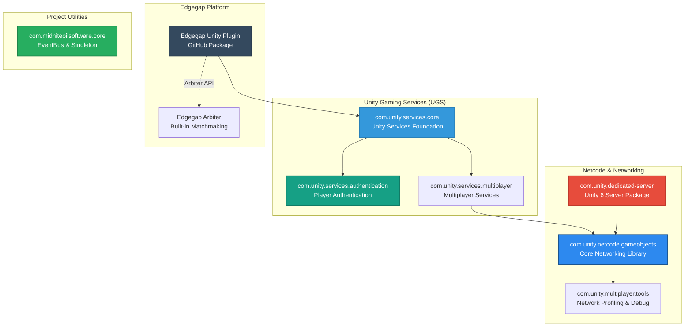

**Deprecated Packages** (DO NOT Install):

- ❌ `com.unity.services.multiplay` - Unity Multiplay discontinued March 2026
- ❌ `com.unity.services.lobby` - Not needed (use Edgegap Arbiter)
- ❌ `com.unity.services.relay` - Not needed (dedicated server)

---

**See Also**:

- [multiplayer-guide-start-here.md](multiplayer-guide-start-here.md) - Migration overview
- [multiplayer-migration-dedicated-server.md](multiplayer-migration-dedicated-server.md) - Dedicated server summary
- [multiplayer-migration-dedicated-server-full.md](multiplayer-migration-dedicated-server-full.md) - Full migration guide
- [ecs-and-multiplayer-architecture-analysis.md](ecs-and-multiplayer-architecture-analysis.md) - Architecture decisions
