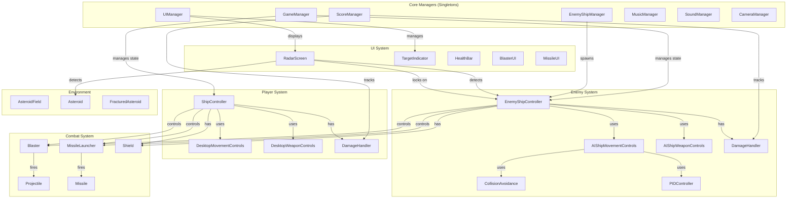
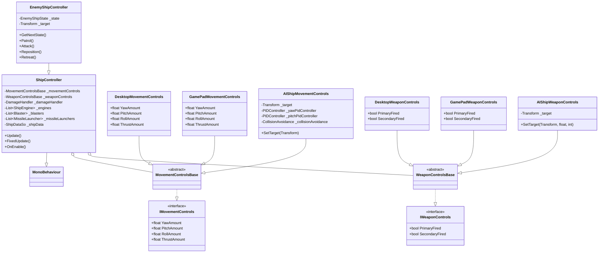
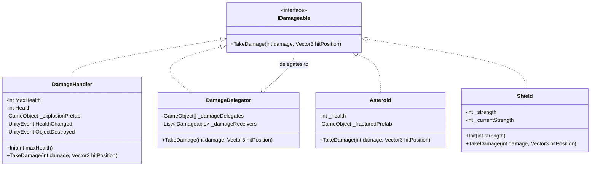
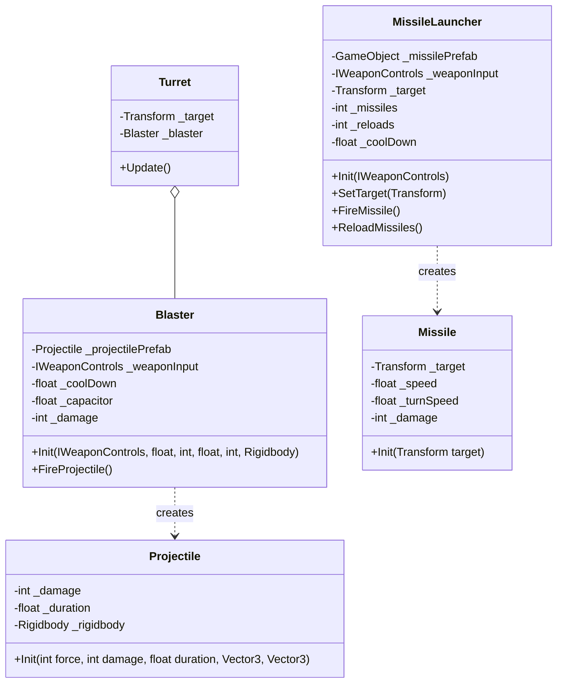
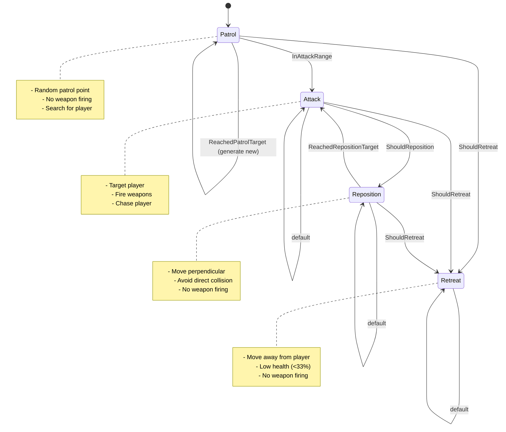

# 3D-Space-Shooter-Tutorial

## Overview

This 3D space shooter game is built using Unity and upgraded to Unity 6000.3 with a modular, component-based architecture.  
Developed as a [multi-episode YouTube tutorial series](https://youtube.com/playlist?list=PLHcOLPSLOK7OBXmVnRv8ixiPZ0DlcywcM&si=dKJw4f17v9ghvygH). 

The game features player-controlled spacecraft, AI-controlled enemy ships, asteroid fields, and a combat system with multiple weapon types.

**Unity Version**: 6000.3  
**Render Pipeline**: Universal Render Pipeline (URP) 17.3.0  
**Input System**: New Input System 1.17.0  
**Camera System**: Cinemachine 2.10.5

### Key Dependencies

- **Unity Input System** (1.17.0): Modern input handling
- **Universal Render Pipeline** (17.3.0): Graphics rendering
- **Cinemachine** (2.10.5): Advanced camera control
- **AI Navigation** (2.0.9): NavMesh components (available but not currently used)
- **TextMesh Pro** (2.0.0): UI text rendering

# 3D Space Shooter - Game Architecture

## Core Design Principles

- **Component-Based Architecture**: Heavy use of Unity's component system for modularity and flexibility
- **Separation of Concerns**: Input handling, movement logic, and weapon systems are separated into distinct components
- **Interface-Driven Design**: Interfaces define contracts for movement controls, weapon controls, and damage handling
- **Data-Driven Configuration**: ScriptableObjects store ship configurations for easy balancing
- **Singleton Pattern**: Core managers use singleton pattern for global access
- **Event-Driven Communication**: UnityEvents and C# events reduce coupling between systems

## Architecture Diagrams

### High-Level System Architecture



### Ship Controller Architecture (Strategy Pattern)



### Damage System (Interface Pattern)



### Manager System (Singleton Pattern)

```mermaid
classDiagram
    class GameManager {
        +static GameManager Instance
        +GameState GameState
        +event Action~GameState~ GameStateChanged
        +InCombat(bool)
        +PlayerWon()
    }
    
    class EnemyShipManager {
        -GameObject[] _enemyShipPrefabs
        -List~GameObject~ _enemyShips
        -int _maxEnemies
        -float _spawnInterval
        +SpawnEnemyShip()
        -OnShipDestroyed(int)
    }
    
    class UIManager {
        +static UIManager Instance
        -List~TargetIndicator~ _targetIndicators
        +AddTarget(Transform)
        +RemoveTarget(Transform)
        +UpdateTargetIndicators(List~Transform~, int)
    }
    
    class ScoreManager {
        +static ScoreManager Instance
        +int Score
        +int HighScore
        +event Action~int~ ScoreChanged
        +event Action~int~ HighScoreChanged
        +AddScore(int)
    }
    
    class MusicManager {
        +static MusicManager Instance
        +PlayPatrolMusic()
        +PlayCombatMusic()
        +PlayGameOverMusic()
    }
    
    class SoundManager {
        +static SoundManager Instance
        +Configure3DAudioSource(AudioSource)
    }
    
    class CameraManager {
        +static CameraManager Instance
        +SwitchCamera()
    }
    
    class Managers {
        -static Managers _instance
    }
    
    Managers o-- GameManager
    Managers o-- EnemyShipManager
    Managers o-- UIManager
    Managers o-- ScoreManager
    Managers o-- MusicManager
    Managers o-- SoundManager
    Managers o-- CameraManager
```



### Weapon System



### State Machine (Enemy AI)



## Key Design Patterns

### 1. Strategy Pattern

**Location**: Ship control systems

- **Interfaces**: `IMovementControls`, `IWeaponControls`
- **Concrete Strategies**: 
  - Movement: `DesktopMovementControls`, `GamePadMovementControls`, `AIShipMovementControls`
  - Weapons: `DesktopWeaponControls`, `GamePadWeaponControls`, `AIShipWeaponControls`
- **Context**: `ShipController` uses interchangeable control strategies
- **Benefit**: Allows runtime swapping of control schemes and supports multiple input methods

### 2. Singleton Pattern

**Location**: Manager classes

- **Implementation**: All managers (`GameManager`, `UIManager`, `ScoreManager`, etc.)
- **Purpose**: Global access point for core systems
- **Features**: 
  - Single instance enforcement
  - Optional `DontDestroyOnLoad` for persistence
- **Considerations**: Used for systems that genuinely need global access

### 3. Observer Pattern

**Location**: Event system

- **C# Events**: `GameStateChanged`, `ScoreChanged`, `HighScoreChanged`
- **UnityEvents**: `HealthChanged`, `ObjectDestroyed`, `MissileFired`, `MissilesReloaded`, `ShipDestroyed`
- **Purpose**: Decouples systems by allowing components to react to events without direct references
- **Examples**:
  - `DamageHandler` fires `HealthChanged` event → `HealthBar` updates display
  - `ScoreManager` fires `ScoreChanged` event → `UIManager` updates score text

### 4. State Pattern

**Location**: Enemy AI

- **Implementation**: `EnemyShipController` with `EnemyShipState` enum
- **States**: None, Patrol, Attack, Reposition, Retreat
- **Benefit**: Clean separation of AI behaviors with explicit state transitions

### 5. Object Pool (Implicit)

**Location**: Projectile and effect systems

- **Note**: While not explicitly implemented, the game instantiates/destroys projectiles and effects
- **Opportunity**: Could be optimized with proper object pooling

### 6. Component Pattern

**Location**: Throughout the entire codebase

- **Unity's Core Pattern**: MonoBehaviour-based components
- **Examples**:
  - Ships composed of: `ShipController`, `DamageHandler`, `Shield`, `ShipEngine`, `Blaster`, `MissileLauncher`
  - Modular, reusable components attached to GameObjects

### 7. Factory Pattern (Implicit)

**Location**: Spawning systems

- **Implementation**: `EnemyShipManager` spawns ships from prefab array
- **Implementation**: `AsteroidField` spawns asteroids from prefab list
- **Benefit**: Centralized creation logic with variation support

### 8. Facade Pattern

**Location**: Manager layer

- **Implementation**: Managers provide simplified interfaces to complex subsystems
- **Example**: `SoundManager.Configure3DAudioSource()` simplifies audio setup

### 9. Data-Driven Design

**Location**: Configuration system

- **Implementation**: `ShipDataSo` ScriptableObject
- **Properties**: Movement forces, weapon stats, health, shield values
- **Benefit**: Balance changes without code modifications

## System Breakdown

### 1. Core Managers

#### GameManager

- **Responsibility**: Overall game state management
- **Pattern**: Singleton
- **Key Features**:
  - Game state tracking (Patrol, Combat, GameOver)
  - Combat state transitions based on enemy presence
  - Input handling for game-level commands
  - Event broadcasting for state changes

#### EnemyShipManager

- **Responsibility**: Enemy spawn management
- **Features**:
  - Timed spawning system
  - Dynamic difficulty (max enemies increases on destruction)
  - Enemy lifecycle management
  - Event-based cleanup

#### UIManager

- **Responsibility**: UI coordination
- **Features**:
  - Target indicator management
  - Score display updates
  - Event subscription to score changes

#### ScoreManager

- **Responsibility**: Score tracking and persistence
- **Pattern**: Singleton
- **Features**:
  - Score accumulation
  - High score persistence (PlayerPrefs)
  - Event broadcasting for score changes via C# events
  - `AddPoints()` method for score incrementation

#### MusicManager

- **Responsibility**: Adaptive music system
- **Pattern**: Singleton
- **Features**:
  - Dynamic music switching based on game state
  - Patrol, Combat, and Game Over music tracks
  - Integrates with `GameManager.GameStateChanged` events

#### SoundManager

- **Responsibility**: Audio configuration and management
- **Pattern**: Singleton
- **Features**:
  - 3D audio source configuration
  - Centralized audio settings
  - Helper methods for consistent audio setup

### 2. Ship Systems

#### ShipController (Base Class)

- **Responsibility**: Core ship functionality
- **Composition**:
  - Movement controls (strategy)
  - Weapon controls (strategy)
  - Damage handler
  - Shield system
  - Engine systems
  - Weapon systems
- **Initialization**: Configures all subsystems with data from `ShipDataSo`
- **Physics**: Applies torque for rotation, thrust handled by engines

#### EnemyShipController (Derived)

- **Additional Responsibility**: AI behavior
- **State Machine**: Patrol → Attack → Reposition/Retreat
- **Decision Making**:
  - Range-based state transitions
  - Health-based retreat logic
  - Collision avoidance integration
- **Target Management**: Dynamic target switching based on state

### 3. Control Systems

#### Movement Controls

- **Desktop**: Mouse position for pitch/yaw, keyboard for roll/thrust
- **GamePad**: Analog stick inputs
- **AI**: PID controllers for smooth target pursuit with collision avoidance

#### Weapon Controls

- **Desktop**: Mouse buttons
- **GamePad**: Controller buttons
- **AI**: Raycast-based firing decisions with range checking

### 4. Combat Systems

#### Blaster

- **Features**:
  - Cooldown system
  - Capacitor system (charge-based damage)
  - Weak vs full-power shots
  - Audio feedback
- **Integration**: Uses `IWeaponControls` for input

#### MissileLauncher

- **Features**:
  - Limited ammunition (configurable per launcher)
  - Reload system with multiple reload cycles
  - Cooldown between shots
  - Target tracking (radar integration)
  - Lock-on requirement before firing
- **Events**: Fires `MissileFired` and `MissilesReloaded` events for UI updates

#### Projectile

- **Features**:
  - Physics-based movement
  - Timed destruction
  - Layer-based collision
  - Velocity inheritance from parent

#### Missile

- **Features**:
  - Homing behavior
  - Target tracking
  - Explosion on impact
  - Proximity detection

### 5. Damage System

#### DamageHandler

- **Responsibility**: Health management
- **Features**:
  - Health initialization
  - Damage processing
  - Event broadcasting
  - Destruction handling with effects

#### DamageDelegator

- **Responsibility**: Distribute damage to multiple targets
- **Use Case**: Ship parts that should damage main ship
- **Pattern**: Delegate pattern

#### Shield

- **Responsibility**: Absorb damage before health
- **Features**:
  - Strength tracking
  - Visual feedback
  - Overflow damage pass-through

### 6. UI Systems

#### RadarScreen

- **Responsibility**: Enemy detection and target tracking
- **Features**:
  - Sphere-based detection
  - Lock-on system (range + angle)
  - 2D radar visualization
  - Height indicator lines with `RadarBlip`
  - Combat state detection
- **Performance**: Coroutine-based refresh with configurable interval

#### TargetIndicator

- **Responsibility**: On-screen target markers
- **Features**:
  - World-to-screen projection
  - Off-screen indicators
  - Lock-on visual state
  - Target lead prediction using quadratic equations
  - Predictive aiming assistance

#### Targetable

- **Responsibility**: Mark objects as trackable targets
- **Features**:
  - Automatic registration with `UIManager`
  - Cleanup on disable/destroy

#### HealthBar

- **Responsibility**: Visual health display
- **Integration**: Subscribes to `DamageHandler` events

#### BlasterUI

- **Responsibility**: Display blaster weapon status
- **Features**:
  - Capacitor charge visualization
  - Cooldown indicators

#### MissileUI

- **Responsibility**: Display missile launcher status
- **Features**:
  - Ammunition count
  - Reload progress indicator
  - Remaining reloads display

### 7. Environment

#### AsteroidField

- **Responsibility**: Asteroid generation
- **Features**:
  - Procedural placement within defined volume
  - Random scale variation
  - Initial rotation for visual variety
  - Supports 15 different asteroid prefab types

#### Asteroid

- **Responsibility**: Destructible space debris
- **Features**:
  - Health-based destruction
  - Fractured variant spawning on destruction
  - Score rewards on destruction
  - Implements `IDamageable` interface

#### FracturedAsteroid

- **Responsibility**: Broken asteroid pieces
- **Features**:
  - Secondary destruction stage
  - Smaller pieces with physics
  - Timed cleanup

### 8. AI Supporting Systems

#### PIDController

- **Responsibility**: Smooth pursuit calculations
- **Purpose**: Reduces jittery AI movement
- **Configuration**: Proportional, Integral, Derivative tuning

#### CollisionAvoidance

- **Responsibility**: Obstacle detection and avoidance
- **Features**:
  - Multi-directional raycasts
  - Horizontal and vertical avoidance vectors
  - Integration with AI movement controls

### 9. Utility Components

#### Turret

- **Responsibility**: Weapon platform that tracks targets
- **Features**:
  - Horizontal base rotation (yaw)
  - Vertical gun elevation (pitch)
  - Smooth rotation interpolation
  - Contains `Blaster` weapon

#### AddPointsWhenDestroyed

- **Responsibility**: Scoring integration for destructible objects
- **Features**:
  - Configurable point values
  - Automatic score registration
  - Integrates with `ScoreManager`

#### MatchRotation

- **Responsibility**: Synchronize rotation with target transform
- **Use Case**: Keeping UI elements or effects aligned

#### SkyboxSetter

- **Responsibility**: Dynamic skybox material selection
- **Features**:
  - Multiple skybox material support
  - Runtime skybox switching capability

## Data Flow Examples

### Player Fires Weapon

```
1. User Input → DesktopWeaponControls.PrimaryFired = true
2. Blaster.Update() checks IWeaponControls.PrimaryFired
3. Blaster.FireProjectile() instantiates projectile
4. Projectile.Init() sets damage, velocity, duration
5. Projectile collides with enemy
6. Enemy's DamageHandler.TakeDamage() processes damage
7. DamageHandler fires HealthChanged event
8. HealthBar updates visual
9. If health <= 0, DamageHandler fires ObjectDestroyed event
10. EnemyShipController.DestroyShip() deactivates ship
11. AddPointsWhenDestroyed adds score to ScoreManager
12. ScoreManager fires ScoreChanged event
13. UIManager updates score text
```

### Enemy AI Decision Making

```
1. EnemyShipController.Update() calls GetNextState()
2. Current state method (e.g., Patrol()) evaluates conditions
3. Checks: InAttackRange, ShouldRetreat, ReachedPatrolTarget
4. Returns new state
5. SetState() compares with current state
6. If different, executes state transition logic
7. Updates target position
8. Configures AIShipMovementControls.SetTarget()
9. Configures AIShipWeaponControls.SetTarget() (if attacking)
10. AIShipMovementControls.Update() calculates pitch/yaw
11. Uses PIDController for smooth target pursuit
12. Integrates CollisionAvoidance adjustments
13. ShipController.FixedUpdate() applies torque
14. Ship moves toward target
```

### Combat State Transition

```
1. RadarScreen coroutine detects enemies in range
2. Adds targets to _targetsInRange list
3. LateUpdate() checks TargetsInRange > 0
4. Sets InCombat = true
5. Calls GameManager.Instance.InCombat(true)
6. GameManager.SetGameState(GameState.Combat)
7. Fires GameStateChanged event
8. MusicManager responds to state change
9. Plays combat music
```

## Project Structure

```
/Assets
├── /_project                       # Main project folder
│   ├── /Scripts                    # All game code
│   │   ├── /Managers               # Singleton managers (GameManager, EnemyShipManager, etc.)
│   │   ├── /ShipControls           # Ship movement and weapon controls
│   │   ├── /ShipSystems            # Damage, health, radar systems
│   │   ├── /Weapons                # Blaster, missile, projectile, turret
│   │   ├── /Asteroids              # Asteroid logic and IDamageable interface
│   │   ├── /UI                     # UI components (TargetIndicator, BlasterUI, MissileUI, Targetable)
│   │   ├── /ScriptableObjects      # Data containers (ShipDataSo)
│   │   ├── /Effects                # Visual effects (Detonator, ShieldExplosion)
│   │   ├── /AnimationControls      # Cockpit animations
│   │   ├── /Debugging              # Debug utilities
│   │   ├── AddPointsWhenDestroyed.cs
│   │   ├── MatchRotation.cs
│   │   └── SkyboxSetter.cs
│   ├── /Prefabs                    # Prefab organization
│   │   ├── /Ships                  # Player and enemy ships
│   │   ├── /Weapons                # Weapon prefabs (blasters, missiles, projectiles)
│   │   ├── /Asteroids              # Asteroid variants (15 types + fractured versions)
│   │   ├── /Effects                # Explosions, shields, particles
│   │   ├── /Ship Systems           # Engines, cameras, shields, health bars, radar blips
│   │   ├── /ShipControls           # Control prefabs (Desktop/GamePad/AI movement & weapons)
│   │   └── /UI                     # UI elements (target indicators, missile UI)
│   ├── /Materials                  # All materials (ships, cockpits, engines, weapons, wings, skybox, detonator)
│   ├── /Meshes                     # Custom meshes
│   ├── /Textures                   # Texture assets (asteroids, ships, skybox, weapons)
│   ├── /Scenes                     # Game scenes (Main.unity)
│   ├── /Data                       # ScriptableObject assets (EnemyFighter, EscortFighter)
│   ├── /Audio                      # Sound effects and music
│   │   ├── /Laser Weapons Sound Pack
│   │   └── /Simple Music
│   ├── /Input                      # Input action assets
│   ├── /Fonts                      # Font assets
│   ├── /Sprites                    # 2D sprite assets
│   ├── /Emitters                   # Particle emitters
│   ├── /Missile                    # Missile-specific assets
│   ├── /Resources                  # Runtime-loaded resources
│   ├── /Sci-fi turrets             # Turret models and textures
│   └── /Render Pipelines           # URP-specific settings
├── /HiRezSpaceshipsCreatorFree     # Third-party spaceship assets
├── /SpaceSkies Free                # Skybox assets (3 skyboxes with multiple resolutions)
├── /_Creepy_Cat                    # VFX pack (3D Games Effects Pack Free)
├── /TextMesh Pro                   # TextMesh Pro assets
└── /Settings                       # Project settings

```
## Layer Architecture

The game uses Unity's layer system for collision filtering:

### Layers
- **Default** (0): Standard objects
- **TransparentFX** (1): Unity default
- **Ignore Raycast** (2): Unity default
- **Background** (3): Background elements
- **Water** (4): Unity default
- **UI** (5): Unity default
- **Player** (6): Player ship and components
- **PlayerProjectile** (7): Player weapon projectiles
- **PlayerShield** (8): Player shield system
- **Enemy** (9): Enemy ships and components
- **EnemyProjectile** (10): Enemy weapon projectiles
- **EnemyShield** (11): Enemy shield system
- **Asteroid** (12): Asteroids and destructible objects

### Tags
- **Untagged**: Default
- **Respawn**: Unity default
- **Finish**: Unity default
- **EditorOnly**: Unity default
- **MainCamera**: Main camera
- **Player**: Player ship
- **GameController**: Game controllers
- **FollowCamera**: Follow camera system
- **CockpitCamera**: Cockpit view camera

**Collision Matrix**: Configured via Physics settings to prevent friendly fire and optimize physics checks (e.g., player projectiles don't collide with player layer).

## Scene Structure

The Main scene (`/Assets/_project/Scenes/Main.unity`) is organized as follows:
```

Main Scene  
├── Managers                        # Core game systems  
│   ├── GameManager                 # Game state management  
│   ├── CameraManager               # Camera switching  
│   ├── UIManager                   # UI coordination  
│   ├── MusicManager                # Adaptive music  
│   ├── SoundManager                # Audio configuration  
│   ├── EnemyShipManager            # Enemy spawning  
│   └── ScoreManager                # Score tracking  
├── --- Background ---              # Visual elements  
│   └── Directional Light           # Scene lighting  
├── --- Camera Setup ---            # Camera systems  
│   ├── Main Camera                 # Primary camera  
│   ├── FollowCamera                # Third-person follow camera (Cinemachine)  
│   │   └── FollowVirtualCamera     # Cinemachine virtual camera  
│   └── EnemyShipFollowCamera       # Enemy tracking camera (Cinemachine)  
│       └── EnemyVirtualCamera      # Cinemachine virtual camera  
├── --- Player Controls ---         # Input control systems  
│   ├── DesktopMovementControls     # Mouse/keyboard movement  
│   ├── DesktopWeaponControls       # Mouse/keyboard weapons  
│   ├── GamePadMovementControls     # Gamepad movement  
│   └── GamePadWeaponControls       # Gamepad weapons  
├── EventSystem                     # Unity UI event system  
├── AsteroidFields                  # Environment objects  
│   ├── AsteroidField (x5)          # Multiple asteroid field instances  
├── Player Ship                     # Player spacecraft  
│   ├── Cockpit3_WithInterior       # Cockpit model with interior  
│   │   ├── CockpitCamera           # First-person view camera  
│   │   └── Cockpit3_InteriorDetails # Interactive cockpit elements  
│   ├── Engine1 (x2)                # Dual engines with thrusters  
│   ├── MainBody components         # Ship hull parts  
│   ├── Wing components             # Wing assemblies  
│   ├── Blaster (x2)                # Dual blaster weapons  
│   ├── Big_Launcher (x2)           # Dual missile launchers  
│   ├── TargetReticle               # Aiming reticle  
│   └── Turret                      # Defensive turret  
└── Target                          # Target practice object

```

### Scene Components
- **Managers GameObject**: Houses all singleton manager scripts
- **Player Ship**: Fully composed ship with weapons, engines, and cockpit
- **Camera Systems**: Multiple Cinemachine virtual cameras for different views
- **Control Systems**: Separate GameObjects for different input methods
- **Environment**: Procedurally populated asteroid fields

## Performance Considerations

### Current Optimizations

- **Radar Refresh**: Coroutine-based with configurable interval (0.25s default)
- **Non-Alloc Physics**: `OverlapSphereNonAlloc` for radar detection
- **Layer Masking**: Filters physics queries to relevant layers
- **Object Deactivation**: Ships deactivated instead of immediate destruction
- **Fixed Array Size**: Pre-allocated arrays for radar target storage

### Potential Improvements

1. **Object Pooling**: Pool projectiles, missiles, and effects
2. **LOD System**: Reduce complexity for distant objects
3. **Spatial Partitioning**: Octree/grid for large asteroid fields
4. **Audio Pooling**: Reuse AudioSource components
5. **UI Optimization**: Batch UI updates, use TextMeshPro
6. **Particle System Pooling**: Reuse explosion effects

## Input System

- **Framework**: Unity's New Input System (1.17.0)
- **Configuration**: Input Action Assets in `/Assets/_project/Input`
- **Abstraction**: Input abstracted through `IMovementControls` and `IWeaponControls` interfaces
- **Support**: Desktop (mouse/keyboard) and GamePad ready
- **Architecture**: Strategy pattern allows runtime control scheme switching
- **Player Input Component**: Attached to Player Ship for input management

## Extension Points

The architecture supports easy extension in several areas:

### Adding New Ship Types

1. Create prefab with `ShipController` or `EnemyShipController`
2. Create `ShipDataSo` for configuration
3. Assign appropriate control scripts (Desktop/GamePad/AI)
4. Add to `EnemyShipManager` spawn list (if enemy)

### Adding New Weapons

1. Implement weapon component (reference `Blaster` or `MissileLauncher`)
2. Use `IWeaponControls` for input
3. Add to ship's weapon list in `ShipController`
4. Create projectile/effect prefabs

### Adding New Control Schemes

1. Create class inheriting `MovementControlsBase` or `WeaponControlsBase`
2. Implement interface methods
3. Assign to ship's control slots

### Adding New Enemy Behaviors

1. Add states to `EnemyShipState` enum
2. Implement state logic methods
3. Define state transitions in `GetNextState()`
4. Update `SetState()` for new state setup

## Known Limitations

1. **No Object Pooling**: High memory churn from frequent instantiation/destruction
2. **Radar Performance**: Could struggle with hundreds of targets
3. **No Network Support**: Single-player only architecture
4. **Limited Save System**: Only high score persisted
5. **No Scene Management**: Single scene design
6. **Fixed Difficulty**: Basic difficulty scaling only through enemy count

## Future Architecture Considerations

1. **Service Locator**: Replace some singletons with service locator for better testability
2. **Command Pattern**: Implement for replay/undo functionality
3. **ECS Integration**: Consider DOTS for massive asteroid fields
4. **Addressables**: Asset loading for larger content library
5. **Network Layer**: Multiplayer support would require significant refactoring
6. **Save System**: Comprehensive save/load with progression
7. **Modding Support**: Plugin architecture for community content

## Getting Started

### Requirements
- Unity 6000.3 or later
- Universal Render Pipeline support
- Input System package enabled in Player Settings

### Running the Project
1. Open the project in Unity 6000.3+
2. Ensure URP is configured (should be automatic)
3. Open `Assets/_project/Scenes/Main.unity`
4. Press Play

### Controls
- **Mouse**: Aim/Look (pitch and yaw)
- **W/S**: Thrust forward/backward
- **A/D or Q/E**: Roll left/right
- **Left Mouse**: Fire blasters (primary weapon)
- **Right Mouse**: Fire missiles (secondary weapon - requires radar lock)
- **C**: Switch camera views
- **R**: Reload missiles (when empty)

### Radar System
- The radar displays enemies and asteroids within detection range
- Lock-on system: Keep target in crosshairs within range to acquire lock
- Target indicators show on-screen position and lead prediction
- Missiles require a locked target to fire

## Development Notes

### ScriptableObject Configuration

Two ship configurations are included:
- **EscortFighter**: Player ship configuration
- **EnemyFighter**: Enemy ship configuration

These define:
- Movement parameters (yaw, pitch, roll, thrust forces)
- Weapon stats (damage, fire rate, capacitor charge)
- Health and shield values

### Animation System

The player cockpit features animated controls:
- Joystick movement
- Button presses
- Switch toggles
- Throttle controls

Managed by `AnimateCockpitControls` component.

### Audio Configuration

3D audio sources are automatically configured via `SoundManager.Configure3DAudioSource()` with:
- Spatial blend: 3D
- Doppler level: 1
- Min/Max distance settings
- Logarithmic rolloff

## Troubleshooting

### Common Issues

1. **Input not working**: Verify Input System package is active in Player Settings > Active Input Handling
2. **Graphics issues**: Ensure URP is properly configured in Graphics Settings
3. **Missing references**: Check that all prefabs have proper component references
4. **Performance issues**: Reduce asteroid count or visual effects quality

## Credits

- **Tutorial Series**: [YouTube Playlist](https://youtube.com/playlist?list=PLHcOLPSLOK7OBXmVnRv8ixiPZ0DlcywcM&si=dKJw4f17v9ghvygH)
- **Asset Creators**: See individual asset folders for attribution
- **Unity Technologies**: Cinemachine, URP, Input System

## Conclusion

This 3D space shooter demonstrates a pragmatic architecture that balances Unity best practices with practical game development needs. The heavy use of interfaces and composition makes the codebase flexible and maintainable. The strategy pattern for controls and the event-driven communication between systems reduce coupling and support future expansion.

**Key Strengths**:
- Modular, component-based design
- Clean separation of concerns via interfaces
- Data-driven configuration through ScriptableObjects
- Event-driven architecture for loose coupling
- Extensible AI system with clear state machine
- Scalable manager pattern for global systems

**Optimization Opportunities**:
- Object pooling for projectiles and effects
- LOD system for distant objects
- Spatial partitioning for large asteroid fields

The current architecture provides a solid foundation for a 3D space combat game and serves as an excellent learning resource for Unity game development patterns and best practices.
```

