# Multiplayer Architecture Diagrams

Visual reference for the multiplayer architecture design.

---

## Network Variables Strategy

**Legend**:

- 🔵 Blue: Player-owned components
- 🟢 Teal: Client-to-server RPCs
- 🟠 Orange: Enemy components (server-controlled)
- 🔴 Red: Server-only logic
- 🟡 Yellow: Projectile components
- 🟣 Purple: Game state components

---

## Multiplayer Data Flow

---

## Component Migration Flow

---

## Player Spawning Architecture

---

## Weapon System Data Flow

---

## Damage Calculation Authority

---

## Enemy AI Synchronization

---

## Lobby & Matchmaking Flow

---

## Object Pooling with Networking

---

## Phase 0 Preparation Dependencies

---

## NetworkTransform Configuration

Detailed configuration settings for NetworkTransform component on player ships.

### Authority Configuration

```mermaid
graph TD
    A[NetworkTransform Component] --> B[Authority Settings]
    A --> C[Position Settings]
    A --> D[Rotation Settings]
    A --> E[Scale Settings]
    A --> F[Performance Settings]
    
    B --> B1[Server Authoritative ✓]
    B --> B2[Sync In Local Space ✗]
    
    C --> C1[Sync XYZ ✓]
    C --> C2[Threshold: 0.01m]
    C --> C3[Smooth Dampening ✓]
    
    D --> D1[Sync XYZ ✓]
    D --> D2[Threshold: 0.1°]
    D --> D3[Quaternion Sync ✓]
    D --> D4[Quaternion Compression ✓]
    
    E --> E1[Sync XYZ ✗]
    
    F --> F1[Half Float Precision ✓]
    F --> F2[Tick Sync Children ✗]
    F --> F3[Unreliable Deltas ✗]
    
    style B1 fill:#27ae60,stroke:#1e8449,stroke-width:2px,color:#fff
    style B2 fill:#e74c3c,stroke:#c0392b,stroke-width:2px,color:#fff
    style C3 fill:#27ae60,stroke:#1e8449,stroke-width:2px,color:#fff
    style D3 fill:#27ae60,stroke:#1e8449,stroke-width:2px,color:#fff
    style D4 fill:#27ae60,stroke:#1e8449,stroke-width:2px,color:#fff
    style E1 fill:#e74c3c,stroke:#c0392b,stroke-width:2px,color:#fff
    style F1 fill:#27ae60,stroke:#1e8449,stroke-width:2px,color:#fff
    style F2 fill:#e74c3c,stroke:#c0392b,stroke-width:2px,color:#fff
    style F3 fill:#e74c3c,stroke:#c0392b,stroke-width:2px,color:#fff
```

### Interpolation Options Comparison

```mermaid
graph LR
    subgraph "Interpolation Methods"
        A[Legacy Lerp]
        B[Lerp]
        C[Smooth Dampening]
    end
    
    subgraph "Characteristics"
        A --> A1[❌ Deprecated]
        A --> A2[Linear movement]
        
        B --> B1[✓ Modern]
        B --> B2[Linear movement]
        B --> B3[Simpler, faster]
        
        C --> C1[✓ Recommended]
        C --> C2[Natural acceleration]
        C --> C3[Best for physics]
    end
    
    style A fill:#e74c3c,stroke:#c0392b,stroke-width:2px,color:#fff
    style B fill:#f39c12,stroke:#c87f0a,stroke-width:2px,color:#000
    style C fill:#27ae60,stroke:#1e8449,stroke-width:2px,color:#fff
```

### Bandwidth Optimization

```mermaid
graph TD
    Start[Player Ship] --> Settings{Optimization Settings}
    
    Settings --> HF[Half Float Precision ✓<br/>~2 KB/s saved]
    Settings --> QC[Quaternion Compression ✓<br/>~0.5 KB/s saved]
    Settings --> TH[Thresholds<br/>30-50% fewer updates]
    
    HF --> Total
    QC --> Total
    TH --> Total
    
    Total[Total Bandwidth] --> Result[2-4 KB/s per ship ✓]
    
    style HF fill:#27ae60,stroke:#1e8449,stroke-width:2px,color:#fff
    style QC fill:#27ae60,stroke:#1e8449,stroke-width:2px,color:#fff
    style TH fill:#27ae60,stroke:#1e8449,stroke-width:2px,color:#fff
    style Result fill:#2d89ef,stroke:#1a5490,stroke-width:2px,color:#fff
```

---

**See Also**:

- [multiplayer-start-here.md](multiplayer-start-here.md) - Migration overview
- [multiplayer-prep.md](multiplayer-prep.md) - Phase 0 preparation
- [multiplayer-migration.md](multiplayer-migration.md) - Full migration guide

