# Multiplayer Migration Guide for 3D Space Shooter

This document outlines the strategy and implementation steps to convert the 3D Space Shooter Tutorial into a multiplayer game using Unity Gaming Services (UGS), Netcode for GameObjects (NGO), Lobby & Relay, supported by the Midnite Oil Software multiplayer boilerplate package.

---

## Table of Contents

1. [Project Overview](#project-overview)
2. [Current Architecture Analysis](#current-architecture-analysis)
3. [Multiplayer Architecture Design](#multiplayer-architecture-design)
4. [Required Packages & Dependencies](#required-packages--dependencies)
5. [Integration with Midnite Oil Boilerplate](#integration-with-midnite-oil-boilerplate)
6. [Migration Steps](#migration-steps)
7. [Component-by-Component Migration](#component-by-component-migration)
8. [Testing Strategy](#testing-strategy)
9. [Performance Considerations](#performance-considerations)
10. [Troubleshooting](#troubleshooting)

**📊 Visual Reference**: [Architecture Diagrams](multiplayer-architecture-diagrams.md) - Mermaid diagrams for data flow, component migration, and network architecture

---

## Project Overview

### Current Game Type

Single-player 3D space combat game with:

- Player-controlled spaceship with desktop/gamepad controls
- AI-controlled enemy ships with patrol and attack behaviors
- Physics-based movement and combat
- Weapon systems (blasters and missiles)
- Asteroid fields as environmental obstacles
- Score tracking and game state management

### Target Multiplayer Type

**Cooperative/Competitive Space Combat**

- 2-8 players in a shared space environment
- PvE: Team up against AI enemies
- PvP: Optional deathmatch/team deathmatch modes
- Synchronized physics-based gameplay
- Shared scoring/leaderboard system

---

## Current Architecture Analysis

### Key Systems Identified

#### 1. **Player Control Systems**

- `ShipController.cs` - Base ship controller
- `DesktopMovementControls.cs` - Mouse/keyboard input
- `DesktopWeaponControls.cs` - Weapon firing input
- `GamePadMovementControls.cs` - Gamepad input
- `GamePadWeaponControls.cs` - Gamepad weapon input

**Migration Impact**: High - Requires NetworkBehaviour conversion and input authority handling

#### 2. **AI Systems**

- `EnemyShipController.cs` - AI ship controller
- `EnemyShipManager.cs` - Enemy spawning and management
- `AIShipMovementControls.cs` - AI movement logic
- `AIShipWeaponControls.cs` - AI weapon logic

**Migration Impact**: Medium - Server authority for AI, synchronized states

#### 3. **Combat Systems**

- `Blaster.cs` - Energy weapon system
- `Missile.cs` - Homing missile projectile
- `MissileLauncher.cs` - Missile launcher system
- `Projectile.cs` - Base projectile
- `DamageHandler.cs` - Health and damage management
- `Shield.cs` - Shield system

**Migration Impact**: High - Requires NetworkObject for projectiles, server-authoritative damage

#### 4. **Game Management**

- `GameManager.cs` - Game state and flow
- `ScoreManager.cs` - Score tracking
- `UIManager.cs` - UI coordination
- `CameraManager.cs` - Camera management

**Migration Impact**: Medium - Requires network synchronization for game state

#### 5. **Environmental Systems**

- `Asteroid.cs` - Destructible asteroids
- `AsteroidField.cs` - Asteroid spawning
- `FracturedAsteroid.cs` - Fractured asteroid pieces

**Migration Impact**: Medium - Synchronized destruction and spawning

### Current Data Flow


---

## Multiplayer Architecture Design

### Network Topology

**Client-Server Architecture** (recommended for authoritative gameplay)


**Key Points**:

- One player acts as Host (server + client)
- Other players connect as clients
- Server has authority over game state, AI, and physics
- Clients have authority over their own input

### Authority Model


### Network Variables Strategy

> 📊 **See [Architecture Diagrams](multiplayer-architecture-diagrams.md) for detailed visual reference**

**Player Ship**:

- Position/Rotation: `NetworkTransform`
- Health: `NetworkVariable<int>`
- Shield Status: `NetworkVariable<float>`
- Score: `NetworkVariable<int>`
- Input: `ServerRpc` from client to server

**Enemy Ships**:

- Position/Rotation: `NetworkTransform`
- Health: `NetworkVariable<int>`
- State: `NetworkVariable<AIState>`
- Target: Server-side only (not replicated)

**Projectiles**:

- Position/Rotation: `NetworkTransform` (with interpolation)
- Ownership: Server
- Spawning: Server-authoritative, replicated to clients

**Game State**:

- Game Phase: `NetworkVariable<GamePhase>`
- Player Count: `NetworkVariable<int>`
- Match Timer: `NetworkVariable<float>`

---

## Required Packages & Dependencies

### Unity Gaming Services Packages

```json
{
  "com.unity.services.core": "1.12.0",
  "com.unity.services.authentication": "3.3.0",
  "com.unity.netcode.gameobjects": "2.0.0",
  "com.unity.services.lobby": "1.2.2",
  "com.unity.services.relay": "1.1.0",
  "com.unity.multiplayer.tools": "2.2.1"
}
```

### Already Installed (Relevant)

- `com.unity.inputsystem`: 1.17.0 ✓
- `com.unity.multiplayer.center`: 1.0.1 ✓

### Midnite Oil Software Boilerplate

**GitHub Repository**: [https://github.com/Midnite-Oil-Software-L-L-C/unity_packages/tree/main/Multiplayer](https://github.com/Midnite-Oil-Software-L-L-C/unity_packages/tree/main/Multiplayer)

**Key Components to Use**:

1. **Connection Management** - Handles UGS authentication, lobby, relay
2. **Network Manager Setup** - Pre-configured NetworkManager
3. **Player Spawning** - Network player spawner system
4. **Session Management** - Lobby creation/joining logic
5. **UI Templates** - Multiplayer menu UI

---

## Integration with Midnite Oil Boilerplate

### Step 1: Import Boilerplate Package

```
1. Download from GitHub repository
2. Copy to /Assets/Other/MidniteOilMultiplayer/
3. Review package structure and documentation
```

### Step 2: Understand Boilerplate Components

#### Connection Flow (from boilerplate)

```
1. Authentication → Sign in anonymously to UGS
2. Lobby Creation/Join → Create or join game lobby
3. Relay Allocation → Get relay join code for P2P connection
4. Network Connection → Connect via Netcode + Relay
5. Player Spawn → Spawn network player objects
```

#### Key Boilerplate Scripts to Integrate

**ConnectionManager** (adapt for space shooter)

- Handles UGS authentication
- Manages lobby operations
- Configures relay transport

**NetworkPlayerSpawner** (extend for ship spawning)

- Server-side player object spawning
- Player tracking and management
- Despawn on disconnect

**LobbyUI** (customize for space shooter theme)

- Lobby browser
- Create/join lobby interface
- Player list display

**GameStateNetworkManager** (extend for space shooter)

- Network game state synchronization
- Match start/end logic
- Player ready states

### Step 3: Customize Boilerplate for Space Shooter

#### Modifications Needed

**Player Spawning**

- Replace default player prefab with Player Ship prefab
- Add spawn point selection (avoid player collision at spawn)
- Configure ship ownership and authority

**Lobby Settings**

- Set max players: 2-8
- Add game mode selection (PvE, PvP, Coop)
- Add map/scenario selection

**UI Integration**

- Merge boilerplate UI with existing UIManager
- Add multiplayer-specific HUD elements (player list, ping display)
- Create pre-game lobby scene

---

## Migration Steps

### Phase 1: Setup & Configuration (Week 1)

#### 1.1 Install Required Packages

```
1. Open Package Manager
2. Add Unity Gaming Services packages via "Add package by name"
3. Install Netcode for GameObjects
4. Import Midnite Oil boilerplate to /Assets/Other/
```

#### 1.2 Configure Unity Gaming Services

```
1. Link project to Unity Cloud Project (Project Settings → Services)
2. Enable Authentication service
3. Enable Lobby service
4. Enable Relay service
5. Configure project settings in Unity Dashboard
```

#### 1.3 Setup Network Manager

```
1. Create /Assets/Prefabs/NetworkManager prefab
2. Add NetworkManager component from boilerplate
3. Configure transport: Unity Transport (Relay compatible)
4. Set network tick rate: 60Hz
5. Configure player prefab (will create in Phase 2)
```

#### 1.4 Create Scene Structure

```
/Assets/_project/Scenes/
  ├── MainMenu.unity (existing + multiplayer UI)
  ├── Lobby.unity (new - pre-game lobby)
  └── Main.unity (existing - gameplay scene)
```

### Phase 2: Core Multiplayer Foundation (Week 2)

#### 2.1 Convert ShipController to NetworkBehaviour

**File**: `/Assets/_project/Scripts/ShipControls/NetworkShipController.cs` (new)

```csharp
using Unity.Netcode;
using UnityEngine;

public class NetworkShipController : NetworkBehaviour
{
    [SerializeField] Shield _shield;
    [SerializeField] protected MovementControlsBase _movementControls;
    [SerializeField] protected WeaponControlsBase _weaponControls;
    [SerializeField] ShipDataSo _shipData;
    [SerializeField] List<ShipEngine> _engines;
    [SerializeField] List<Blaster> _blasters;
    [SerializeField] protected List<MissileLauncher> _missileLaunchers;
    [SerializeField] private AnimateCockpitControls _cockpitAnimationControls;

    Rigidbody _rigidBody;
    NetworkDamageHandler _damageHandler;

    // Network variables
    NetworkVariable<int> _networkHealth = new NetworkVariable<int>();
    NetworkVariable<float> _networkShieldStrength = new NetworkVariable<float>();
    
    // Input variables (client → server)
    [Range(-1f, 1f)] float _pitchAmount, _rollAmount, _yawAmount = 0f;
    float _thrustAmount = 0f;

    public override void OnNetworkSpawn()
    {
        base.OnNetworkSpawn();
        
        _rigidBody = GetComponent<Rigidbody>();
        _damageHandler = GetComponent<NetworkDamageHandler>();
        
        // Server initializes ship systems
        if (IsServer)
        {
            InitializeShipSystems();
        }
        
        // Only enable input for owner
        if (IsOwner)
        {
            EnablePlayerControls();
        }
        else
        {
            DisableNonOwnerControls();
        }
    }

    void Update()
    {
        // Only process input if owner
        if (!IsOwner) return;
        
        // Gather input
        _rollAmount = _movementControls.RollAmount;
        _yawAmount = _movementControls.YawAmount;
        _pitchAmount = _movementControls.PitchAmount;
        _thrustAmount = _movementControls.ThrustAmount;
        
        // Send input to server
        SendInputToServerRpc(_pitchAmount, _rollAmount, _yawAmount, _thrustAmount);
    }

    [ServerRpc]
    void SendInputToServerRpc(float pitch, float roll, float yaw, float thrust)
    {
        // Server processes input
        _pitchAmount = pitch;
        _rollAmount = roll;
        _yawAmount = yaw;
        _thrustAmount = thrust;
    }

    void FixedUpdate()
    {
        // Only server simulates physics
        if (!IsServer) return;
        
        ApplyShipPhysics();
    }

    void ApplyShipPhysics()
    {
        if (!Mathf.Approximately(0f, _pitchAmount))
        {
            _rigidBody.AddTorque(transform.right * (_shipData.PitchForce * _pitchAmount * Time.fixedDeltaTime));
        }

        if (!Mathf.Approximately(0f, _rollAmount))
        {
            _rigidBody.AddTorque(transform.forward * (_shipData.RollForce * _rollAmount * Time.fixedDeltaTime));
        }

        if (!Mathf.Approximately(0f, _yawAmount))
        {
            _rigidBody.AddTorque(transform.up * (_yawAmount * _shipData.YawForce * Time.fixedDeltaTime));
        }
    }

    void EnablePlayerControls()
    {
        // Enable input controls
        _movementControls.enabled = true;
        _weaponControls.enabled = true;
    }

    void DisableNonOwnerControls()
    {
        // Disable input for non-owners
        _movementControls.enabled = false;
        _weaponControls.enabled = false;
    }

    void InitializeShipSystems()
    {
        foreach (ShipEngine engine in _engines)
        {
            engine.Init(_movementControls, _rigidBody, _shipData.ThrustForce / _engines.Count);
        }

        foreach (Blaster blaster in _blasters)
        {
            blaster.Init(_weaponControls, _shipData.BlasterCooldown, _shipData.BlasterLaunchForce, 
                        _shipData.BlasterProjectileDuration, _shipData.BlasterDamage, _rigidBody);
        }

        foreach (MissileLauncher launcher in _missileLaunchers)
        {
            launcher.Init(_weaponControls);
        }

        if (_shield)
        {
            _shield.Init(_shipData.ShieldStrength);
        }
    }
}
```

#### 2.2 Create Network Damage Handler

**File**: `/Assets/_project/Scripts/ShipSystems/NetworkDamageHandler.cs` (new)

```csharp
using Unity.Netcode;
using UnityEngine;
using UnityEngine.Events;

public class NetworkDamageHandler : NetworkBehaviour, IDamageable
{
    [SerializeField] GameObject _explosionPrefab;
    
    public NetworkVariable<int> Health = new NetworkVariable<int>();
    public NetworkVariable<int> MaxHealth = new NetworkVariable<int>();
    
    public UnityEvent HealthChanged = new UnityEvent();
    public UnityEvent ObjectDestroyed = new UnityEvent();

    public override void OnNetworkSpawn()
    {
        base.OnNetworkSpawn();
        
        // Subscribe to health changes
        Health.OnValueChanged += OnHealthValueChanged;
    }

    public override void OnNetworkDespawn()
    {
        Health.OnValueChanged -= OnHealthValueChanged;
        base.OnNetworkDespawn();
    }

    [ServerRpc(RequireOwnership = false)]
    public void InitializeServerRpc(int maxHealth)
    {
        Health.Value = maxHealth;
        MaxHealth.Value = maxHealth;
    }

    public void TakeDamage(int damage, Vector3 hitPosition)
    {
        // Only server can process damage
        if (!IsServer) return;
        
        TakeDamageServerRpc(damage, hitPosition);
    }

    [ServerRpc(RequireOwnership = false)]
    void TakeDamageServerRpc(int damage, Vector3 hitPosition)
    {
        Health.Value -= damage;
        
        if (Health.Value <= 0)
        {
            DestroyObjectClientRpc(hitPosition);
        }
    }

    [ClientRpc]
    void DestroyObjectClientRpc(Vector3 explosionPosition)
    {
        if (_explosionPrefab)
        {
            Instantiate(_explosionPrefab, explosionPosition, Quaternion.identity);
        }
        
        ObjectDestroyed.Invoke();
        
        // Server despawns the network object
        if (IsServer)
        {
            GetComponent<NetworkObject>().Despawn();
        }
    }

    void OnHealthValueChanged(int oldValue, int newValue)
    {
        HealthChanged.Invoke();
    }
}
```

#### 2.3 Create Player Ship Network Prefab

**Steps**:

```
1. Duplicate /Player Ship → /Assets/_project/Prefabs/Ships/PlayerShipNetwork

2. Add NetworkObject component:
   - Global Object Id Hash: (auto-generated - leave as is)
   - Synchronize Transform: false (we'll use NetworkTransform instead)
   - Active Scene Synchronization: true
   - Scene Migration Synchronization: true
   - Spawn With Observers: true
   - Don't Destroy With Owner: false (ship destroyed when player disconnects)
   - Auto Object Parent Sync: true
   - Allow Owner to Parent: false (ship doesn't need reparenting during gameplay)
   - Ownership: Session Owner ← THIS IS THE KEY SETTING
     (Session Owner means the client who spawns/owns this object has authority)

3. Add NetworkTransform component:
   **Authority & Synchronization:**
   - Authority Mode: Server Authoritative (server simulates physics, clients replicate)
   - Sync In Local Space: false (sync in world space)
   
   **Position Settings:**
   - Sync Position X: true
   - Sync Position Y: true
   - Sync Position Z: true
   - Position Threshold: 0.01 (sync if moved >1cm)
   - Position Interpolation Type: Smooth Dampening (best for physics-based ships)
   
   **Rotation Settings:**
   - Sync Rotation X: true
   - Sync Rotation Y: true
   - Sync Rotation Z: true
   - Rot Angle Threshold: 0.1 (sync if rotated >0.1 degrees)
   - Rotation Interpolation Type: Smooth Dampening (best for physics-based rotation)
   - Use Quaternion Synchronization: true (prevents gimbal lock)
   - Use Quaternion Compression: true (reduces bandwidth)
   
   **Scale Settings:**
   - Sync Scale X: false
   - Sync Scale Y: false
   - Sync Scale Z: false
   (ship doesn't change size)
   
   **Performance & Advanced:**
   - Use Half Float Precision: true (reduces bandwidth by ~50%)
   - Tick Sync Children: false (we don't need to sync child transforms)
   - Use Unreliable Deltas: false (use reliable transport for player ships)
     Note: Set to true only if you need maximum performance and can tolerate occasional 
     position/rotation stutters. For player ships, reliable is better.

4. Replace ShipController with NetworkShipController (from Phase 2.1)

5. Replace DamageHandler with NetworkDamageHandler (from Phase 2.2)

6. Configure Rigidbody:
   - Is Kinematic: false (server simulates physics)
   - Interpolate: Interpolate (smooth physics)
   - Collision Detection: Continuous Dynamic (for fast-moving ship)

7. Register in NetworkManager:
   - Open your NetworkManager prefab/GameObject
   - In the NetworkManager component, find "Player Prefab" field
   - Drag PlayerShipNetwork prefab into this field
   - Alternative: Add to "Default Player Prefabs" list for multi-ship support
```

**Understanding Ownership Settings**:

#### 2.4 Network Transform Configuration Details

The NetworkTransform component handles position/rotation synchronization. Here's the optimal configuration for a fast-moving spaceship:

**Complete Component Settings Reference**:

### NetworkTransform Component Configuration

#### Authority Settings


#### Position Synchronization

```mermaid
graph LR
    subgraph "Sync Position"
        P1[X Axis ✓]
        P2[Y Axis ✓]
        P3[Z Axis ✓]
    end
    
    subgraph "Threshold"
        T1[Position Threshold: 0.01]
        T2[Only sync if moved >1cm]
        T3[Reduces network updates]
    end
    
    subgraph "Interpolation"
        I1[Smooth Dampening ✓]
        I2[Lerp]
        I3[Legacy Lerp ✗ deprecated]
    end
    
    P1 --> T1
    P2 --> T1
    P3 --> T1
    T1 --> I1
    
    style I1 fill:#27ae60,stroke:#1e8449,stroke-width:2px,color:#fff
    style I2 fill:#f39c12,stroke:#c87f0a,stroke-width:2px,color:#000
    style I3 fill:#95a5a6,stroke:#7f8c8d,stroke-width:1px,color:#000
```



**Recommendation**: Use **Smooth Dampening** for physics-based ships - provides natural, smooth interpolation.

#### Rotation Synchronization

```mermaid
graph TD
    subgraph "Sync Rotation"
        R1[X Axis ✓]
        R2[Y Axis ✓]
        R3[Z Axis ✓]
    end
    
    subgraph "Settings"
        S1[Rot Angle Threshold: 0.1°]
        S2[Interpolation: Smooth Dampening ✓]
        S3[Use Quaternion Sync: true ✓]
        S4[Use Quaternion Compression: true ✓]
    end
    
    subgraph "Benefits"
        B1[Prevents gimbal lock]
        B2[Saves ~25% bandwidth]
        B3[Natural rotation]
    end
    
    R1 --> S1
    R2 --> S1
    R3 --> S1
    S1 --> S2
    S3 --> B1
    S4 --> B2
    S2 --> B3
    
    style S2 fill:#27ae60,stroke:#1e8449,stroke-width:2px,color:#fff
    style S3 fill:#27ae60,stroke:#1e8449,stroke-width:2px,color:#fff
    style S4 fill:#27ae60,stroke:#1e8449,stroke-width:2px,color:#fff
```



#### Scale Settings

```mermaid
graph LR
    A[Sync Scale] --> B[X Axis ✗]
    A --> C[Y Axis ✗]
    A --> D[Z Axis ✗]
    
    E[Reason] --> F[Ships don't change size]
    F --> G[No need to sync scale]
    
    style B fill:#ffcccc
    style C fill:#ffcccc
    style D fill:#ffcccc
```



#### Performance & Advanced Settings

```mermaid
graph TD
    subgraph "Optimization"
        O1[Use Half Float Precision: true ✓]
        O2[16-bit floats vs 32-bit]
        O3[Saves ~50% bandwidth]
    end
    
    subgraph "Child Synchronization"
        C1[Tick Sync Children: false ✗]
        C2[Don't sync child transforms]
        C3[Weapons/engines move with parent]
    end
    
    subgraph "Transport Mode"
        T1[Use Unreliable Deltas: false ✗]
        T2[Use RELIABLE transport]
        T3[Ensures updates arrive]
    end
    
    O1 --> O2 --> O3
    C1 --> C2 --> C3
    T1 --> T2 --> T3
    
    style O1 fill:#90ee90
    style C1 fill:#ffcccc
    style T1 fill:#ffcccc
```



#### When to Use Unreliable Deltas


**Why These Settings?**

**Bandwidth Estimate** (per player ship at 60 ticks/sec):

- With these settings: ~2-4 KB/s per ship
- Half float precision: ~2 KB/s savings
- Thresholds: 30-50% reduction in update frequency
- Quaternion compression: ~0.5 KB/s savings
- **Total**: Well within typical game bandwidth budgets

### Phase 3: Weapon System Networking (Week 3)

#### 3.1 Network Blaster System

**File**: `/Assets/_project/Scripts/Weapons/NetworkBlaster.cs` (new)

```csharp
using Unity.Netcode;
using UnityEngine;

public class NetworkBlaster : NetworkBehaviour
{
    [SerializeField] Projectile _projectilePrefab, _weakProjectilePrefab;
    [SerializeField] AudioClip _fireSound;
    [SerializeField] Transform _muzzle;

    public NetworkVariable<float> CapacitorCharge = new NetworkVariable<float>();
    
    float _maxCapacitor = 1000f;
    float _costPerShot = 50f;
    float _rechargeRate = 20f;
    float _coolDownTime;
    int _launchForce, _damage;
    float _duration;
    float _coolDown;
    Rigidbody _rigidBody;
    AudioSource _audioSource;

    public float CapacitorChargePercentage => CapacitorCharge.Value / _maxCapacitor;
    public float CoolDownPercent => Mathf.Clamp(_coolDown / _coolDownTime, 0f, 1f);

    void Awake()
    {
        _audioSource = SoundManager.Configure3DAudioSource(GetComponent<AudioSource>());
    }

    void Update()
    {
        // Only server updates capacitor
        if (IsServer)
        {
            CapacitorCharge.Value = Mathf.Min(_maxCapacitor, 
                CapacitorCharge.Value + (_rechargeRate * Time.deltaTime));
            _coolDown -= Time.deltaTime;
        }
    }

    public void Init(float coolDown, int launchForce, float duration, int damage, Rigidbody rigidBody)
    {
        _coolDownTime = coolDown;
        _launchForce = launchForce;
        _duration = duration;
        _damage = damage;
        _rigidBody = rigidBody;
        
        if (IsServer)
        {
            CapacitorCharge.Value = _maxCapacitor;
        }
    }

    public void TryFire()
    {
        if (!IsOwner) return;
        
        // Request fire from server
        FireProjectileServerRpc();
    }

    [ServerRpc]
    void FireProjectileServerRpc()
    {
        if (_coolDown > 0f) return;

        bool fullCharge = CapacitorCharge.Value >= _costPerShot;
        CapacitorCharge.Value = Mathf.Max(CapacitorCharge.Value - _costPerShot, 0);
        _coolDown = _coolDownTime;

        // Spawn projectile on server
        Projectile projectile = Instantiate(
            fullCharge ? _projectilePrefab : _weakProjectilePrefab, 
            _muzzle.position, 
            transform.rotation
        );
        
        var networkObject = projectile.GetComponent<NetworkObject>();
        networkObject.Spawn();
        
        projectile.Init(_launchForce, fullCharge ? _damage : (int)(_damage * 0.1f), 
            _duration, _rigidBody.linearVelocity, _rigidBody.angularVelocity);

        // Play sound on all clients
        PlayFireSoundClientRpc();
    }

    [ClientRpc]
    void PlayFireSoundClientRpc()
    {
        if (_fireSound)
        {
            _audioSource.PlayOneShot(_fireSound);
        }
    }
}
```

#### 3.2 Network Projectile

**File**: `/Assets/_project/Scripts/Weapons/NetworkProjectile.cs` (new)

```csharp
using Unity.Netcode;
using UnityEngine;

public class NetworkProjectile : NetworkBehaviour
{
    [SerializeField] int _damage;
    [SerializeField] float _duration;
    [SerializeField] GameObject _impactPrefab;
    
    Rigidbody _rigidbody;
    float _destroyTime;

    public override void OnNetworkSpawn()
    {
        base.OnNetworkSpawn();
        _rigidbody = GetComponent<Rigidbody>();
    }

    public void Init(int launchForce, int damage, float duration, 
        Vector3 inheritedVelocity, Vector3 inheritedAngularVelocity)
    {
        if (!IsServer) return;
        
        _damage = damage;
        _duration = duration;
        _destroyTime = Time.time + duration;
        
        _rigidbody.linearVelocity = transform.forward * launchForce + inheritedVelocity;
        _rigidbody.angularVelocity = inheritedAngularVelocity;
    }

    void Update()
    {
        if (!IsServer) return;
        
        if (Time.time >= _destroyTime)
        {
            DespawnProjectile();
        }
    }

    void OnCollisionEnter(Collision collision)
    {
        if (!IsServer) return;
        
        var damageable = collision.gameObject.GetComponent<IDamageable>();
        if (damageable != null)
        {
            damageable.TakeDamage(_damage, collision.GetContact(0).point);
        }
        
        SpawnImpactEffectClientRpc(collision.GetContact(0).point, collision.GetContact(0).normal);
        DespawnProjectile();
    }

    [ClientRpc]
    void SpawnImpactEffectClientRpc(Vector3 position, Vector3 normal)
    {
        if (_impactPrefab)
        {
            Instantiate(_impactPrefab, position, Quaternion.LookRotation(normal));
        }
    }

    void DespawnProjectile()
    {
        if (IsServer)
        {
            GetComponent<NetworkObject>().Despawn();
            Destroy(gameObject);
        }
    }
}
```

#### 3.3 Create Network Projectile Prefab

**Steps**:

```
1. Duplicate existing projectile prefabs
2. Add NetworkObject component
3. Add NetworkTransform (position only, high interpolation)
4. Replace Projectile script with NetworkProjectile
5. Configure collision layers for multiplayer
6. Add to NetworkManager spawnable prefabs list
```

### Phase 4: Enemy AI Networking (Week 3-4)

#### 4.1 Network Enemy Controller

**File**: `/Assets/_project/Scripts/ShipControls/NetworkEnemyShipController.cs` (new)

```csharp
using Unity.Netcode;
using UnityEngine;

public class NetworkEnemyShipController : NetworkBehaviour
{
    [SerializeField] float _patrolRange = 2000f, _attackRange = 1000f;
    [SerializeField] ShipDataSo _shipData;
    
    enum EnemyShipState { None, Patrol, Attack, Reposition, Retreat }
    
    NetworkVariable<EnemyShipState> _state = new NetworkVariable<EnemyShipState>();
    NetworkVariable<ulong> _targetClientId = new NetworkVariable<ulong>();
    
    AIShipMovementControls _aiShipMovementControls;
    AIShipWeaponControls _aiShipWeaponControls;
    Transform _transform;
    Transform _target;
    Rigidbody _rigidBody;

    public override void OnNetworkSpawn()
    {
        base.OnNetworkSpawn();
        
        _transform = transform;
        _rigidBody = GetComponent<Rigidbody>();
        
        // Only server runs AI logic
        if (IsServer)
        {
            _aiShipMovementControls = GetComponent<AIShipMovementControls>();
            _aiShipWeaponControls = GetComponent<AIShipWeaponControls>();
            SetState(EnemyShipState.Patrol);
        }
    }

    void Update()
    {
        // Only server runs AI
        if (!IsServer) return;
        
        EnemyShipState newState = GetNextState();
        SetState(newState);
    }

    void FixedUpdate()
    {
        // Only server simulates physics
        if (!IsServer) return;
        
        ApplyAIPhysics();
    }

    EnemyShipState GetNextState()
    {
        // AI state machine logic (same as original)
        // ...
        return _state.Value;
    }

    void SetState(EnemyShipState newState)
    {
        if (_state.Value == newState) return;
        
        _state.Value = newState;
        
        // State-specific logic
        switch (newState)
        {
            case EnemyShipState.Patrol:
                // Set patrol target
                break;
            case EnemyShipState.Attack:
                // Find closest player
                _target = FindClosestPlayer();
                break;
            // ... other states
        }
    }

    Transform FindClosestPlayer()
    {
        // Find closest player-controlled ship
        var players = FindObjectsByType<NetworkShipController>(FindObjectsSortMode.None);
        Transform closest = null;
        float closestDistance = float.MaxValue;
        
        foreach (var player in players)
        {
            if (!player.IsOwner) continue;
            
            float distance = Vector3.Distance(_transform.position, player.transform.position);
            if (distance < closestDistance)
            {
                closestDistance = distance;
                closest = player.transform;
            }
        }
        
        return closest;
    }

    void ApplyAIPhysics()
    {
        // Apply movement forces (same as original but server-only)
        // ...
    }
}
```

#### 4.2 Network Enemy Spawner

**File**: `/Assets/_project/Scripts/Managers/NetworkEnemyShipManager.cs` (new)

```csharp
using Unity.Netcode;
using UnityEngine;
using System.Collections.Generic;

public class NetworkEnemyShipManager : NetworkBehaviour
{
    [SerializeField] GameObject[] _enemyShipPrefabs;
    [SerializeField] int _maxEnemies = 3;
    [SerializeField] float _spawnInterval = 30f;
    [SerializeField] float _minSpawnRange = 500f, _maxSpawnRange = 2000f;

    List<NetworkObject> _spawnedEnemies = new List<NetworkObject>();
    float _spawnDelay;

    public override void OnNetworkSpawn()
    {
        base.OnNetworkSpawn();
        
        // Only server spawns enemies
        if (IsServer)
        {
            _spawnDelay = 10f;
        }
    }

    void Update()
    {
        if (!IsServer) return;
        
        _spawnDelay -= Time.deltaTime;
        
        if (_spawnDelay <= 0f && _spawnedEnemies.Count < _maxEnemies)
        {
            SpawnEnemy();
            _spawnDelay = _spawnInterval;
        }
    }

    void SpawnEnemy()
    {
        Vector3 spawnPosition = Random.insideUnitSphere * Random.Range(_minSpawnRange, _maxSpawnRange);
        GameObject enemyPrefab = _enemyShipPrefabs[Random.Range(0, _enemyShipPrefabs.Length)];
        
        GameObject enemy = Instantiate(enemyPrefab, spawnPosition, Quaternion.identity);
        NetworkObject networkObject = enemy.GetComponent<NetworkObject>();
        networkObject.Spawn();
        
        _spawnedEnemies.Add(networkObject);
        
        // Listen for destruction
        var controller = enemy.GetComponent<NetworkEnemyShipController>();
        controller.GetComponent<NetworkDamageHandler>().ObjectDestroyed.AddListener(() => OnEnemyDestroyed(networkObject));
    }

    void OnEnemyDestroyed(NetworkObject enemy)
    {
        _spawnedEnemies.Remove(enemy);
    }
}
```

### Phase 5: Game State & Lobby Integration (Week 4-5)

#### 5.1 Network Game Manager

**File**: `/Assets/_project/Scripts/Managers/NetworkGameManager.cs` (new)

```csharp
using Unity.Netcode;
using UnityEngine;

public enum NetworkGameState
{
    Lobby,
    Starting,
    InProgress,
    Ending,
    GameOver
}

public class NetworkGameManager : NetworkBehaviour
{
    public static NetworkGameManager Instance;
    
    public NetworkVariable<NetworkGameState> GameState = new NetworkVariable<NetworkGameState>();
    public NetworkVariable<int> PlayerCount = new NetworkVariable<int>();
    public NetworkVariable<float> MatchTimer = new NetworkVariable<float>();

    void Awake()
    {
        if (Instance != null && Instance != this)
        {
            Destroy(gameObject);
            return;
        }
        Instance = this;
        DontDestroyOnLoad(gameObject);
    }

    public override void OnNetworkSpawn()
    {
        base.OnNetworkSpawn();
        
        if (IsServer)
        {
            NetworkManager.Singleton.OnClientConnectedCallback += OnClientConnected;
            NetworkManager.Singleton.OnClientDisconnectCallback += OnClientDisconnected;
            
            UpdatePlayerCount();
        }
        
        GameState.OnValueChanged += OnGameStateChanged;
    }

    public override void OnNetworkDespawn()
    {
        if (IsServer)
        {
            NetworkManager.Singleton.OnClientConnectedCallback -= OnClientConnected;
            NetworkManager.Singleton.OnClientDisconnectCallback -= OnClientDisconnected;
        }
        
        GameState.OnValueChanged -= OnGameStateChanged;
        base.OnNetworkDespawn();
    }

    void OnClientConnected(ulong clientId)
    {
        UpdatePlayerCount();
    }

    void OnClientDisconnected(ulong clientId)
    {
        UpdatePlayerCount();
        
        // End game if too few players
        if (PlayerCount.Value < 1)
        {
            EndMatch();
        }
    }

    void UpdatePlayerCount()
    {
        if (!IsServer) return;
        PlayerCount.Value = NetworkManager.Singleton.ConnectedClients.Count;
    }

    [ServerRpc(RequireOwnership = false)]
    public void StartMatchServerRpc()
    {
        if (GameState.Value != NetworkGameState.Lobby) return;
        
        GameState.Value = NetworkGameState.Starting;
        StartMatchClientRpc();
    }

    [ClientRpc]
    void StartMatchClientRpc()
    {
        // Countdown UI, etc.
        Invoke(nameof(BeginMatch), 3f);
    }

    void BeginMatch()
    {
        if (IsServer)
        {
            GameState.Value = NetworkGameState.InProgress;
        }
    }

    public void EndMatch()
    {
        if (!IsServer) return;
        
        GameState.Value = NetworkGameState.Ending;
        EndMatchClientRpc();
    }

    [ClientRpc]
    void EndMatchClientRpc()
    {
        // Show end game UI, scores, etc.
    }

    void OnGameStateChanged(NetworkGameState oldState, NetworkGameState newState)
    {
        Debug.Log($"Game state changed: {oldState} → {newState}");
        // Update UI, music, etc.
    }
}
```

#### 5.2 Integration with Midnite Oil Connection Manager

**File**: `/Assets/_project/Scripts/Managers/SpaceShooterConnectionManager.cs` (new)

```csharp
using UnityEngine;
using Unity.Services.Core;
using Unity.Services.Authentication;
using Unity.Services.Lobby;
using Unity.Services.Relay;
using Unity.Netcode;
using Unity.Netcode.Transports.UTP;

public class SpaceShooterConnectionManager : MonoBehaviour
{
    // Extend Midnite Oil ConnectionManager
    // Add custom space shooter-specific lobby settings
    
    [SerializeField] string _gameMode = "PvE";
    [SerializeField] int _maxPlayers = 4;
    
    async void Start()
    {
        await UnityServices.InitializeAsync();
        await AuthenticationService.Instance.SignInAnonymouslyAsync();
        Debug.Log($"Signed in as {AuthenticationService.Instance.PlayerId}");
    }

    public async void CreateLobby()
    {
        try
        {
            // Create relay allocation
            var allocation = await RelayService.Instance.CreateAllocationAsync(_maxPlayers);
            var joinCode = await RelayService.Instance.GetJoinCodeAsync(allocation.AllocationId);
            
            // Create lobby
            var options = new Unity.Services.Lobby.Models.CreateLobbyOptions
            {
                Data = new Dictionary<string, Unity.Services.Lobby.Models.DataObject>
                {
                    { "GameMode", new Unity.Services.Lobby.Models.DataObject(
                        Unity.Services.Lobby.Models.DataObject.VisibilityOptions.Public, _gameMode) },
                    { "RelayJoinCode", new Unity.Services.Lobby.Models.DataObject(
                        Unity.Services.Lobby.Models.DataObject.VisibilityOptions.Member, joinCode) }
                }
            };
            
            var lobby = await LobbyService.Instance.CreateLobbyAsync("Space Battle", _maxPlayers, options);
            
            // Configure transport
            var transport = NetworkManager.Singleton.GetComponent<UnityTransport>();
            transport.SetRelayServerData(allocation.RelayServer.IpV4, allocation.RelayServer.Port, 
                allocation.AllocationIdBytes, allocation.Key, allocation.ConnectionData);
            
            // Start host
            NetworkManager.Singleton.StartHost();
            
            Debug.Log($"Lobby created: {lobby.LobbyCode}");
        }
        catch (System.Exception e)
        {
            Debug.LogError($"Failed to create lobby: {e}");
        }
    }

    public async void JoinLobby(string lobbyCode)
    {
        try
        {
            var lobby = await LobbyService.Instance.JoinLobbyByCodeAsync(lobbyCode);
            var relayJoinCode = lobby.Data["RelayJoinCode"].Value;
            
            var joinAllocation = await RelayService.Instance.JoinAllocationAsync(relayJoinCode);
            
            // Configure transport
            var transport = NetworkManager.Singleton.GetComponent<UnityTransport>();
            transport.SetRelayServerData(joinAllocation.RelayServer.IpV4, joinAllocation.RelayServer.Port,
                joinAllocation.AllocationIdBytes, joinAllocation.Key, joinAllocation.ConnectionData, 
                joinAllocation.HostConnectionData);
            
            // Start client
            NetworkManager.Singleton.StartClient();
            
            Debug.Log($"Joined lobby: {lobbyCode}");
        }
        catch (System.Exception e)
        {
            Debug.LogError($"Failed to join lobby: {e}");
        }
    }
}
```

#### 5.3 Network Score Manager

**File**: `/Assets/_project/Scripts/Managers/NetworkScoreManager.cs` (new)

```csharp
using Unity.Netcode;
using UnityEngine;
using System.Collections.Generic;

public class NetworkScoreManager : NetworkBehaviour
{
    public static NetworkScoreManager Instance;
    
    // Player scores: clientId → score
    NetworkList<PlayerScore> _playerScores;
    
    public struct PlayerScore : INetworkSerializable
    {
        public ulong ClientId;
        public int Score;
        public FixedString64Bytes PlayerName;

        public void NetworkSerialize<T>(BufferSerializer<T> serializer) where T : IReaderWriter
        {
            serializer.SerializeValue(ref ClientId);
            serializer.SerializeValue(ref Score);
            serializer.SerializeValue(ref PlayerName);
        }
    }

    void Awake()
    {
        if (Instance != null)
        {
            Destroy(gameObject);
            return;
        }
        Instance = this;
    }

    public override void OnNetworkSpawn()
    {
        base.OnNetworkSpawn();
        
        if (IsServer)
        {
            _playerScores = new NetworkList<PlayerScore>();
        }
    }

    [ServerRpc(RequireOwnership = false)]
    public void AddPointsServerRpc(ulong clientId, int points)
    {
        for (int i = 0; i < _playerScores.Count; i++)
        {
            if (_playerScores[i].ClientId == clientId)
            {
                var score = _playerScores[i];
                score.Score += points;
                _playerScores[i] = score;
                return;
            }
        }
        
        // Player not found, add new entry
        _playerScores.Add(new PlayerScore 
        { 
            ClientId = clientId, 
            Score = points, 
            PlayerName = $"Player {clientId}" 
        });
    }

    public int GetPlayerScore(ulong clientId)
    {
        foreach (var score in _playerScores)
        {
            if (score.ClientId == clientId)
                return score.Score;
        }
        return 0;
    }

    public List<PlayerScore> GetSortedScores()
    {
        var scores = new List<PlayerScore>(_playerScores);
        scores.Sort((a, b) => b.Score.CompareTo(a.Score));
        return scores;
    }
}
```

### Phase 6: UI & Polish (Week 5-6)

#### 6.1 Multiplayer HUD

**Create**: `/Assets/_project/Scripts/UI/MultiplayerHUD.cs`

Features:

- Player list with ping indicators
- Network stats (latency, packet loss)
- Scoreboard (toggle with Tab)
- Connection status indicators
- Player ship health bars (for teammates)

#### 6.2 Lobby UI

**Create**: `/Assets/_project/Scripts/UI/LobbyUI.cs`

Features:

- Host/Join selection
- Lobby code display/input
- Player list in lobby
- Ready status for each player
- Game mode selection
- Start match button (host only)

#### 6.3 Camera System Updates

**Modify**: `/Assets/_project/Scripts/Managers/CameraManager.cs`

```csharp
// Update camera to follow local player only
void SetupCamera()
{
    var localPlayer = FindLocalPlayerShip();
    if (localPlayer != null)
    {
        _followCamera.Follow = localPlayer.transform;
        _followCamera.LookAt = localPlayer.transform;
    }
}

NetworkShipController FindLocalPlayerShip()
{
    var ships = FindObjectsByType<NetworkShipController>(FindObjectsSortMode.None);
    foreach (var ship in ships)
    {
        if (ship.IsOwner)
            return ship;
    }
    return null;
}
```

### Phase 7: Testing & Optimization (Week 6-7)

#### 7.1 Local Testing Setup

```
1. Use ParrelSync for multi-instance testing
2. Test with 2-4 players locally
3. Verify input authority and ownership
4. Test projectile synchronization
5. Verify damage and score replication
```

#### 7.2 Network Performance Testing

```
1. Use Multiplayer Tools package
   - Runtime Net Stats Monitor
   - Network Profiler
2. Test with simulated network conditions:
   - 50ms latency
   - 100ms latency
   - 5% packet loss
3. Optimize NetworkTransform update rates
4. Implement object pooling for projectiles
```

#### 7.3 Edge Case Testing

```
1. Host migration (if implemented)
2. Mid-game disconnections
3. Late joiners
4. Spawn point conflicts
5. Synchronization of asteroid destruction
6. AI behavior with multiple targets
```

---

## Component-by-Component Migration

### Summary Table

---

## Testing Strategy

### Unit Testing

- Test RPC calls in isolation
- Verify NetworkVariable synchronization
- Test ownership transfer
- Validate server authority for damage

### Integration Testing

- Multi-client scenarios (2, 4, 8 players)
- AI enemy spawning and targeting
- Projectile collision detection across clients
- Score synchronization

### Performance Testing

- Bandwidth usage monitoring
- Frame rate testing with max players
- Latency simulation (50ms, 100ms, 200ms)
- Stress test: Max enemies + max projectiles

### Playtesting

- Gather feedback on responsiveness
- Identify desync issues
- Evaluate gameplay balance in multiplayer
- Test different network conditions

---

## Performance Considerations

### Bandwidth Optimization

1. **Reduce NetworkTransform update frequency** for non-critical objects
2. **Use half-float precision** where possible
3. **Implement dead reckoning** for smoother movement prediction
4. **Pool NetworkObjects** for projectiles to reduce spawn overhead
5. **Compress NetworkVariables** using custom serialization

### CPU Optimization

1. **Limit physics simulation** on clients (server-authoritative)
2. **Reduce raycasts** for AI targeting
3. **Optimize collision detection** with proper layer masks
4. **Cache component references** to avoid GetComponent calls
5. **Use object pooling** for frequently spawned objects

### Network Topology Considerations

- **Max Players**: 8 (recommended for hosted P2P via Relay)
- **Tick Rate**: 30-60Hz (balance between responsiveness and bandwidth)
- **Snapshot Interpolation**: Enable for smooth movement
- **Lag Compensation**: Consider client-side prediction for player input

### Relay vs Direct Connection

- **Use Relay for public matches** (NAT traversal, easier connectivity)
- **Consider direct connection** for LAN parties (lower latency)
- **Relay limits**: Check Unity Gaming Services quotas

---

## Troubleshooting

### Common Issues

#### 1. **Players not spawning**

- Verify player prefab is registered in NetworkManager
- Check NetworkObject component is present
- Ensure server is calling Spawn() on NetworkObject
- Verify scene has PlayerSpawnPoint objects

#### 2. **Projectiles not synchronizing**

- Confirm projectile prefabs in NetworkManager spawnable list
- Verify NetworkTransform on projectile
- Check collision layers are correct
- Ensure server authority for spawning

#### 3. **Input lag / delayed movement**

- Reduce NetworkTransform thresholds
- Enable interpolation on NetworkTransform
- Implement client-side prediction
- Check network latency with Network Profiler

#### 4. **Damage not registering**

- Verify server authority for damage processing
- Check IDamageable implementation on NetworkBehaviour
- Ensure collision layers allow projectile-ship collision
- Verify RPC calls are executing on server

#### 5. **Score not syncing**

- Confirm NetworkScoreManager is spawned on network start
- Verify NetworkList or NetworkVariable usage
- Check ServerRpc permissions
- Ensure score updates go through server

#### 6. **Lobby connection failures**

- Verify UGS project is configured correctly
- Check Authentication service is initialized
- Confirm Lobby and Relay services are enabled
- Verify relay allocation is created before lobby

#### 7. **Host migration issues**

- Implement proper NetworkManager shutdown
- Save/restore game state during migration
- Re-establish connections via new relay allocation
- Consider using dedicated server instead

---

## Next Steps After Migration

### Post-Launch Features

1. **Dedicated Server Support** - Move to dedicated servers for larger matches
2. **Matchmaking** - Implement skill-based matchmaking
3. **Ranked Mode** - Add competitive ranked gameplay
4. **Replays** - Record and playback matches
5. **Spectator Mode** - Allow observers to watch matches
6. **In-Game Voice Chat** - Integrate Vivox or similar
7. **Custom Loadouts** - Networked ship customization
8. **Persistent Progression** - Cloud save integration
9. **Anti-Cheat** - Server-side validation for all actions
10. **Analytics** - Track player behavior and balance

### Learning Resources

- **Unity Netcode Documentation**: [https://docs-multiplayer.unity3d.com/netcode/current/about/](https://docs-multiplayer.unity3d.com/netcode/current/about/)
- **Unity Gaming Services**: [https://docs.unity.com/ugs/](https://docs.unity.com/ugs/)
- **Midnite Oil Boilerplate**: [https://github.com/Midnite-Oil-Software-L-L-C/unity_packages](https://github.com/Midnite-Oil-Software-L-L-C/unity_packages)
- **Netcode Community**: [https://discord.com/invite/unity](https://discord.com/invite/unity)
- **Best Practices**: [https://docs-multiplayer.unity3d.com/netcode/current/learn/](https://docs-multiplayer.unity3d.com/netcode/current/learn/)

---

## Conclusion

This migration will transform your single-player space shooter into an engaging multiplayer experience. The phased approach ensures each system is properly tested before moving to the next. By leveraging Unity Gaming Services and the Midnite Oil boilerplate, you'll have a robust foundation for lobby management and network connectivity.

Remember to test frequently, start with small multiplayer sessions, and gradually scale up as systems are validated. Good luck with your multiplayer migration!

---

**Document Version**: 1.0  
**Last Updated**: 2024  
**Author**: Bezi AI Assistant  
**Project**: 3D Space Shooter Tutorial - Multiplayer Migration