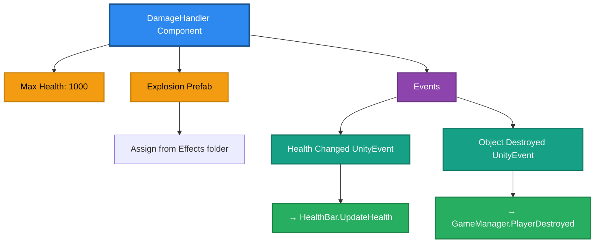
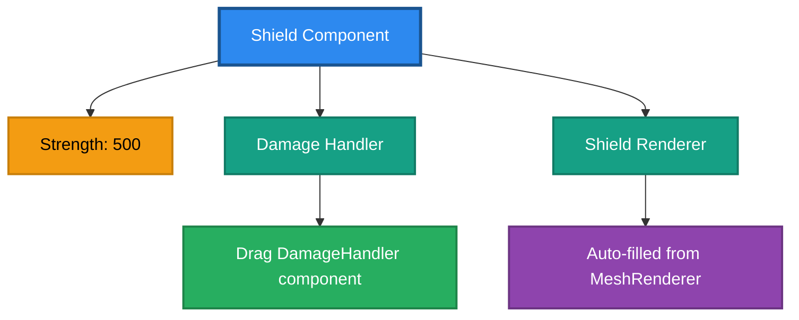
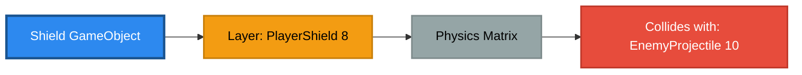
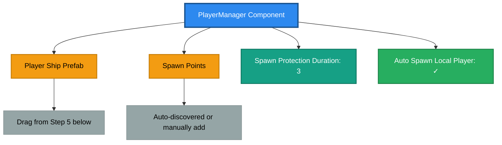
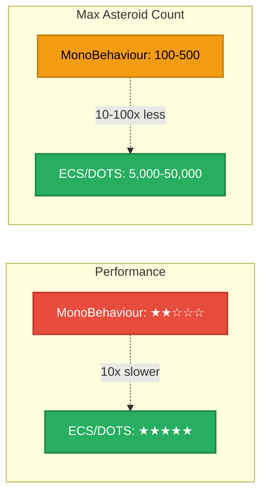
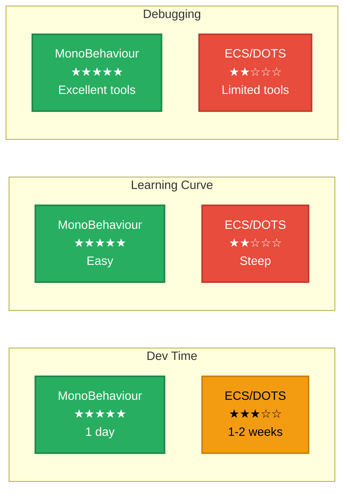
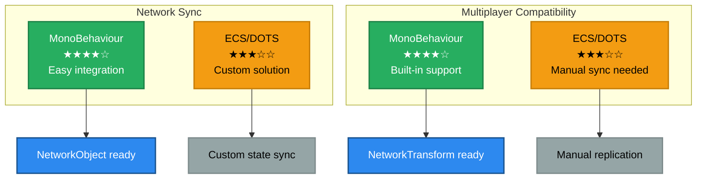
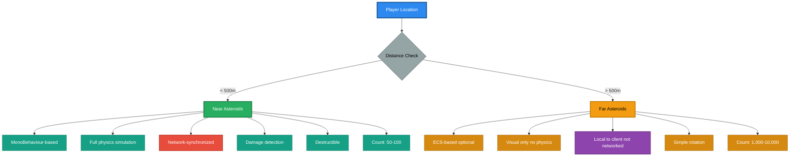
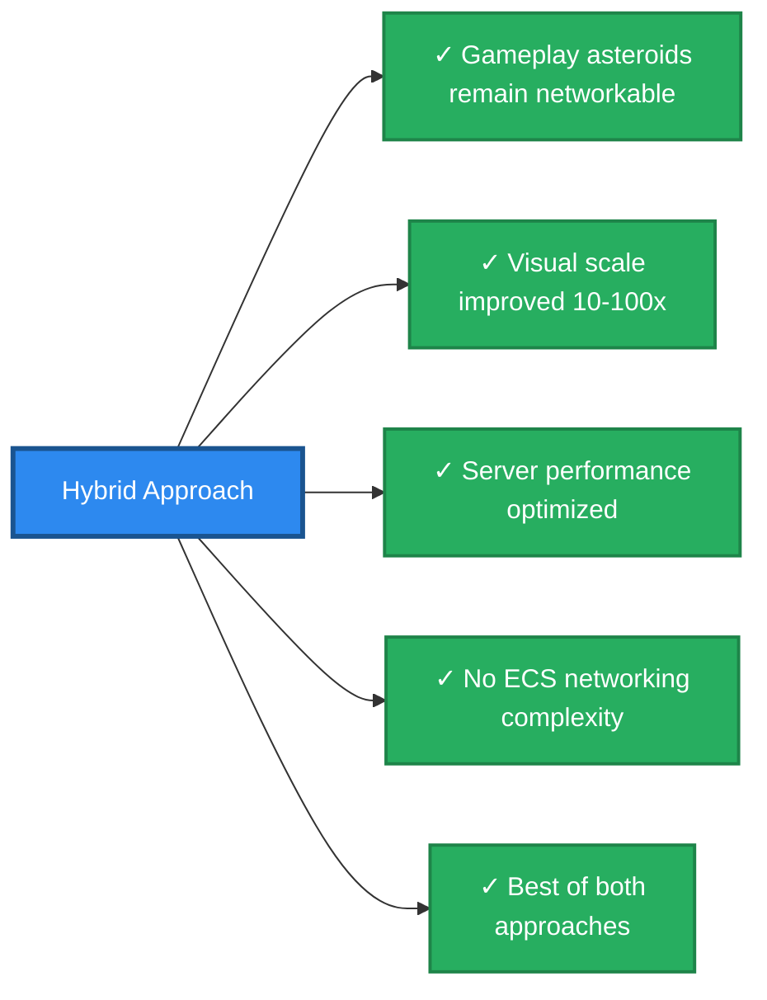

# Multiplayer Preparation Phase

**Purpose**: Pre-multiplayer foundation work to ensure smooth multiplayer migration.

**Prerequisites**: Complete single-player game with all core systems functional.

---

## Overview

Before adding multiplayer networking, we need to establish foundational systems that will make the multiplayer migration smoother and more efficient. These changes improve the single-player game while preparing the architecture for network synchronization.

This preparation phase implements:

1. **Player Ship Combat**: Shield, damage, and destruction capabilities
2. **PlayerManager**: Centralized player spawning and management
3. **Object Pooling**: Performance optimization for frequent spawning
4. **ECS/DOTS Investigation**: Evaluation for asteroid system optimization

---

## 0.1 Player Ship: Shield, Damage & Destruction

**Goal**: Ensure the player ship has complete combat capabilities matching enemy ships.

**Why This Matters for Multiplayer**:

- Player ships must be able to take damage and be destroyed (PvP/PvE)
- Health and shield systems need to be network-synchronized
- Event-driven damage system converts easily to network RPCs
- Consistent combat mechanics across all ship types

### Current State Analysis

```
Existing Systems:
✓ ShipController.cs - Base ship control
✓ DamageHandler.cs - Damage system (used by enemies)
✓ Shield.cs - Shield absorption system
✓ ShipDataSo.cs - Configuration data

Needs Verification:
? Player ship has DamageHandler component
? Player ship has Shield component
? Player death triggers game state change
? Health UI displays player health
```

### Implementation Steps

#### Step 1: Verify/Add DamageHandler to Player Ship

```
1. Open /Assets/_project/Scenes/Main.unity
2. Select /Player Ship GameObject
3. Check for DamageHandler component:
   
   If MISSING:
   - Click "Add Component"
   - Search for "DamageHandler"
   - Add component
   
   If PRESENT:
   - Verify configuration (see Step 2)
```

#### Step 2: Configure Player Ship DamageHandler

**Inspector Settings for DamageHandler Component**:



**Configuration Steps**:

#### Step 3: Add/Verify Shield System

**1. Create Shield GameObject** (if missing):

```
a. Right-click /Player Ship → Create Empty
b. Name: "Shield"
c. Add Shield component
d. Add MeshRenderer (visual shield bubble)
e. Add SphereCollider:
   - Is Trigger: ✓
   - Radius: 15 (larger than ship)
f. Assign shield material from /Assets/_project/Materials/
```

**2. Configure Shield Component**:



**3. Layer Configuration**:



#### Step 4: Update ShipController for Player Damage

```csharp
File: /Assets/_project/Scripts/ShipControls/ShipController.cs

Add damage system initialization:

[SerializeField] DamageHandler _damageHandler;
[SerializeField] Shield _shield;

void OnEnable()
{
    // Existing initialization...
    
    InitializeDamageSystem();
}

void InitializeDamageSystem()
{
    if (_damageHandler != null)
    {
        _damageHandler.Init(_shipData.MaxHealth);
        _damageHandler.ObjectDestroyed.AddListener(OnShipDestroyed);
    }
    
    if (_shield != null)
    {
        _shield.Init(_shipData.ShieldStrength);
    }
}

void OnShipDestroyed()
{
    Debug.Log("Player ship destroyed!");
    
    // Disable controls
    if (_movementControls != null)
        _movementControls.enabled = false;
    
    if (_weaponControls != null)
        _weaponControls.enabled = false;
    
    // Disable ship visuals
    foreach (var renderer in GetComponentsInChildren<Renderer>())
    {
        renderer.enabled = false;
    }
    
    // Disable weapons
    foreach (var blaster in _blasters)
    {
        blaster.enabled = false;
    }
    
    // Notify game manager
    if (GameManager.Instance != null)
    {
        GameManager.Instance.PlayerDestroyed();
    }
    
    // Destroy ship after explosion plays
    Destroy(gameObject, 3f);
}

void OnDisable()
{
    if (_damageHandler != null)
    {
        _damageHandler.ObjectDestroyed.RemoveListener(OnShipDestroyed);
    }
}
```

#### Step 5: Update ShipDataSo for Health/Shield

```csharp
File: /Assets/_project/Scripts/ScriptableObjects/ShipDataSo.cs

Add survivability fields:

[Header("Survivability")]
public int MaxHealth = 1000;
public int ShieldStrength = 500;
```

Then configure the asset:

```
1. Open /Assets/_project/Data/EscortFighter.asset
2. Expand "Survivability" section
3. Set values:
   - Max Health: 1000
   - Shield Strength: 500
4. Save asset
```

#### Step 6: Add Player HealthBar UI

```
1. Open /Assets/_project/Scenes/Main.unity
2. Navigate to /Managers/UIManager/Canvas
3. Create Player Health UI:

   Right-click Canvas → UI → Slider
   - Name: "PlayerHealthBar"
   - Position: Anchor bottom-left
     Pos X: 150, Pos Y: 50
   - Width: 200, Height: 20
   
4. Configure Slider:
   - Min Value: 0
   - Max Value: 1
   - Value: 1
   - Interactable: ✗
   
5. Styling:
   - Background: Dark gray
   - Fill: Green to red gradient
   
6. Add HealthBar component (if you have one):
   - Or create simple HealthBar.cs script
   
7. Wire up events:
   - Select /Player Ship
   - In DamageHandler component
   - Health Changed event:
     → PlayerHealthBar.UpdateHealth()
```

#### Step 7: Update GameManager for Player Death

```csharp
File: /Assets/_project/Scripts/Managers/GameManager.cs

Add player destruction handler:

public void PlayerDestroyed()
{
    Debug.Log("Player ship destroyed!");
    
    // Transition to Game Over state
    SetGameState(GameState.GameOver);
    
    // Show game over UI
    if (UIManager.Instance != null)
    {
        UIManager.Instance.ShowGameOverScreen();
    }
    
    // Stop enemy spawning
    var enemyManager = FindFirstObjectByType<EnemyShipManager>();
    if (enemyManager != null)
    {
        enemyManager.StopSpawning();
    }
    
    // Optional: Disable music, show final score, etc.
    if (MusicManager.Instance != null)
    {
        MusicManager.Instance.PlayGameOverMusic();
    }
}
```

### Testing Checklist

```
Test Scenario 1: Player Takes Damage
- [ ] Start game
- [ ] Let enemy shoot player
- [ ] Verify health bar decreases
- [ ] Verify shield absorbs damage first
- [ ] Verify shield visual effect plays

Test Scenario 2: Shield Depletion
- [ ] Take damage until shield depletes
- [ ] Verify health starts decreasing
- [ ] Verify shield visual disappears

Test Scenario 3: Player Destruction
- [ ] Take damage until health = 0
- [ ] Verify explosion effect plays
- [ ] Verify ship visuals disable
- [ ] Verify controls stop responding
- [ ] Verify game transitions to Game Over
- [ ] Verify UI displays game over screen

Test Scenario 4: Edge Cases
- [ ] Verify no errors if shield is null
- [ ] Verify no errors if damage handler is null
- [ ] Verify destruction only happens once
```

### Multiplayer Benefits

```
✅ DamageHandler → NetworkDamageHandler (easy conversion)
✅ Health/Shield already use NetworkVariable pattern
✅ Events convert to RPCs seamlessly
✅ Destruction flow well-defined for replication
✅ Consistent damage system across all ships
```

---

## 0.2 PlayerManager/PlayerSpawner System

**Goal**: Create centralized system for spawning and managing player ships.

**Why This Matters for Multiplayer**:

- Multiplayer requires dynamic player spawning as clients connect
- Spawn points prevent player collision/overlap at spawn
- Player tracking essential for teams, scoring, UI
- Separation of concerns: spawning ≠ scene setup
- NetworkManager.PlayerPrefab integration point

### Architecture Design

```
Current (Single-Player):
/Player Ship (hardcoded in scene)
  └─ Components directly attached

Target (Multiplayer-Ready):
/SpawnPoints
  ├─ SpawnPoint_0 (0, 0, 0)
  ├─ SpawnPoint_1 (200, 0, 200)
  ├─ SpawnPoint_2 (-200, 0, 200)
  └─ SpawnPoint_3 (0, 0, 400)

/Managers/PlayerManager
  └─ Spawns PlayerShip prefab at available spawn points
  └─ Tracks active players
  └─ Handles player lifecycle

Prefab: /Assets/_project/Prefabs/Ships/PlayerShip.prefab
```

### Implementation Steps

#### Step 1: Create PlayerSpawnPoint Component

```csharp
File: /Assets/_project/Scripts/Managers/PlayerSpawnPoint.cs (new)

using UnityEngine;

public class PlayerSpawnPoint : MonoBehaviour
{
    [SerializeField] int _spawnIndex;
    [SerializeField] bool _isOccupied;
    
    public int SpawnIndex => _spawnIndex;
    public bool IsOccupied => _isOccupied;
    public Vector3 Position => transform.position;
    public Quaternion Rotation => transform.rotation;
    
    public void SetOccupied(bool occupied)
    {
        _isOccupied = occupied;
    }
    
    void OnDrawGizmos()
    {
        // Visual representation in Scene view
        Gizmos.color = _isOccupied ? Color.red : Color.green;
        Gizmos.DrawWireSphere(transform.position, 10f);
        Gizmos.DrawRay(transform.position, transform.forward * 50f);
        
        #if UNITY_EDITOR
        UnityEditor.Handles.Label(
            transform.position + Vector3.up * 20f, 
            $"Spawn {_spawnIndex}\n{(_isOccupied ? "Occupied" : "Available")}"
        );
        #endif
    }
    
    void OnDrawGizmosSelected()
    {
        // Show spawn direction when selected
        Gizmos.color = Color.cyan;
        Gizmos.DrawLine(transform.position, transform.position + transform.forward * 100f);
    }
}
```

#### Step 2: Create PlayerManager

```csharp
File: /Assets/_project/Scripts/Managers/PlayerManager.cs (new)

using UnityEngine;
using System.Collections.Generic;
using System.Linq;

public class PlayerManager : MonoBehaviour
{
    public static PlayerManager Instance { get; private set; }
    
    [Header("Player Prefabs")]
    [SerializeField] GameObject _playerShipPrefab;
    
    [Header("Spawn Configuration")]
    [SerializeField] List<PlayerSpawnPoint> _spawnPoints = new List<PlayerSpawnPoint>();
    [SerializeField] float _spawnProtectionDuration = 3f;
    [SerializeField] bool _autoSpawnLocalPlayer = true;
    
    [Header("Player Tracking")]
    List<GameObject> _activePlayers = new List<GameObject>();
    Dictionary<GameObject, int> _playerIndexMap = new Dictionary<GameObject, int>();
    
    public int ActivePlayerCount => _activePlayers.Count;
    public List<GameObject> ActivePlayers => new List<GameObject>(_activePlayers);
    
    void Awake()
    {
        if (Instance != null && Instance != this)
        {
            Destroy(gameObject);
            return;
        }
        Instance = this;
    }
    
    void Start()
    {
        AutoDiscoverSpawnPoints();
        
        if (_autoSpawnLocalPlayer)
        {
            SpawnLocalPlayer();
        }
    }
    
    void AutoDiscoverSpawnPoints()
    {
        if (_spawnPoints.Count == 0)
        {
            _spawnPoints = FindObjectsByType<PlayerSpawnPoint>(FindObjectsSortMode.None)
                .OrderBy(sp => sp.SpawnIndex)
                .ToList();
            
            Debug.Log($"Auto-discovered {_spawnPoints.Count} spawn points");
        }
    }
    
    public GameObject SpawnLocalPlayer()
    {
        return SpawnPlayer(0, isLocalPlayer: true);
    }
    
    public GameObject SpawnPlayer(int playerIndex, bool isLocalPlayer = false)
    {
        PlayerSpawnPoint spawnPoint = GetAvailableSpawnPoint(playerIndex);
        
        if (spawnPoint == null)
        {
            Debug.LogError("No available spawn points!");
            return null;
        }
        
        if (_playerShipPrefab == null)
        {
            Debug.LogError("Player Ship Prefab not assigned!");
            return null;
        }
        
        // Instantiate player ship
        GameObject player = Instantiate(
            _playerShipPrefab, 
            spawnPoint.Position, 
            spawnPoint.Rotation
        );
        player.name = $"Player_{playerIndex}";
        
        // Mark spawn point as occupied
        spawnPoint.SetOccupied(true);
        
        // Track player
        _activePlayers.Add(player);
        _playerIndexMap[player] = playerIndex;
        
        // Apply spawn protection
        if (_spawnProtectionDuration > 0f)
        {
            ApplySpawnProtection(player);
        }
        
        // Notify systems
        OnPlayerSpawned(player, playerIndex, isLocalPlayer);
        
        Debug.Log($"Spawned player {playerIndex} at {spawnPoint.Position}");
        return player;
    }
    
    PlayerSpawnPoint GetAvailableSpawnPoint(int preferredIndex)
    {
        // Validate spawn points exist
        if (_spawnPoints.Count == 0)
        {
            Debug.LogError("No spawn points configured!");
            return null;
        }
        
        // Try preferred spawn point first
        if (preferredIndex >= 0 && preferredIndex < _spawnPoints.Count)
        {
            if (!_spawnPoints[preferredIndex].IsOccupied)
            {
                return _spawnPoints[preferredIndex];
            }
        }
        
        // Find any available spawn point
        foreach (var spawnPoint in _spawnPoints)
        {
            if (!spawnPoint.IsOccupied)
                return spawnPoint;
        }
        
        // All occupied, reuse first spawn point
        Debug.LogWarning("All spawn points occupied, reusing spawn point 0");
        return _spawnPoints[0];
    }
    
    void ApplySpawnProtection(GameObject player)
    {
        // Temporary invulnerability (implement as needed)
        var damageHandler = player.GetComponent<DamageHandler>();
        if (damageHandler != null)
        {
            // Could set a temporary immunity flag
            Debug.Log($"Spawn protection active for {_spawnProtectionDuration}s");
            // TODO: Implement immunity in DamageHandler
        }
        
        // Visual indicator (optional)
        // Could spawn shield effect, change layer temporarily, etc.
    }
    
    void OnPlayerSpawned(GameObject player, int playerIndex, bool isLocalPlayer)
    {
        // Wire up camera for local player
        if (isLocalPlayer && CameraManager.Instance != null)
        {
            CameraManager.Instance.SetFollowTarget(player.transform);
        }
        
        // Notify UI
        if (UIManager.Instance != null)
        {
            // UIManager.Instance.OnPlayerSpawned(player);
        }
        
        // Listen for destruction
        var damageHandler = player.GetComponent<DamageHandler>();
        if (damageHandler != null)
        {
            damageHandler.ObjectDestroyed.AddListener(() => OnPlayerDestroyed(player));
        }
    }
    
    void OnPlayerDestroyed(GameObject player)
    {
        if (!_activePlayers.Contains(player))
            return;
        
        // Get player index
        int playerIndex = _playerIndexMap.ContainsKey(player) ? _playerIndexMap[player] : -1;
        
        // Remove from tracking
        _activePlayers.Remove(player);
        _playerIndexMap.Remove(player);
        
        // Free spawn point
        FreeSpawnPointNearPosition(player.transform.position);
        
        // Notify game manager
        if (GameManager.Instance != null)
        {
            GameManager.Instance.PlayerDestroyed();
        }
        
        Debug.Log($"Player {playerIndex} destroyed. Remaining players: {_activePlayers.Count}");
    }
    
    void FreeSpawnPointNearPosition(Vector3 position)
    {
        foreach (var spawnPoint in _spawnPoints)
        {
            if (Vector3.Distance(spawnPoint.Position, position) < 50f)
            {
                spawnPoint.SetOccupied(false);
                break;
            }
        }
    }
    
    public void RespawnPlayer(int playerIndex)
    {
        // For future multiplayer respawn functionality
        SpawnPlayer(playerIndex);
    }
    
    public GameObject GetPlayer(int playerIndex)
    {
        foreach (var kvp in _playerIndexMap)
        {
            if (kvp.Value == playerIndex)
                return kvp.Key;
        }
        return null;
    }
    
    public GameObject GetLocalPlayer()
    {
        // For single-player, return first player
        // For multiplayer, this will return player owned by this client
        return _activePlayers.Count > 0 ? _activePlayers[0] : null;
    }
    
    public int GetPlayerIndex(GameObject player)
    {
        return _playerIndexMap.ContainsKey(player) ? _playerIndexMap[player] : -1;
    }
}
```

#### Step 3: Setup Spawn Points in Scene

```
1. Open /Assets/_project/Scenes/Main.unity

2. Create Spawn Points Container:
   Right-click Hierarchy → Create Empty
   - Name: "SpawnPoints"
   - Position: (0, 0, 0)
   - Rotation: (0, 0, 0)

3. Create Individual Spawn Points:

   SpawnPoint_0:
   - Right-click /SpawnPoints → Create Empty
   - Name: "SpawnPoint_0"
   - Transform:
     Position: (0, 0, 0)
     Rotation: (0, 0, 0)
   - Add Component: PlayerSpawnPoint
   - Spawn Index: 0

   SpawnPoint_1:
   - Right-click /SpawnPoints → Create Empty
   - Name: "SpawnPoint_1"
   - Transform:
     Position: (200, 0, 200)
     Rotation: (0, -90, 0)  [facing inward]
   - Add Component: PlayerSpawnPoint
   - Spawn Index: 1

   SpawnPoint_2:
   - Right-click /SpawnPoints → Create Empty
   - Name: "SpawnPoint_2"
   - Transform:
     Position: (-200, 0, 200)
     Rotation: (0, 90, 0)  [facing inward]
   - Add Component: PlayerSpawnPoint
   - Spawn Index: 2

   SpawnPoint_3:
   - Right-click /SpawnPoints → Create Empty
   - Name: "SpawnPoint_3"
   - Transform:
     Position: (0, 0, 400)
     Rotation: (0, 180, 0)  [facing inward]
   - Add Component: PlayerSpawnPoint
   - Spawn Index: 3

4. Verify in Scene View:
   - Green spheres = available spawn points
   - Blue arrows = spawn direction (forward)
   - Labels show spawn index
```

#### Step 4: Create PlayerManager in Scene

**1. Create GameObject**:

```
1. Navigate to /Managers GameObject
2. Right-click → Create Empty
3. Name: "PlayerManager"
4. Add Component: PlayerManager
```

**2. Configure PlayerManager Component**:



#### Step 5: Create Player Ship Prefab

```
Option A: If Player Ship is currently in scene

1. Select /Player Ship GameObject in hierarchy
2. Drag to /Assets/_project/Prefabs/Ships/ folder
3. Name: "PlayerShip"
4. Delete original from scene (PlayerManager will spawn it)

Option B: Create new prefab from scratch

1. Create empty prefab: Assets → Create → Prefab
2. Name: PlayerShip
3. Open prefab in Prefab Mode
4. Add all necessary components:
   - ShipController
   - DamageHandler
   - Shield
   - Rigidbody
   - Engines, weapons, etc.
5. Save prefab

Verify Prefab Contents:
- ShipController (configured)
- DamageHandler (max health set)
- Shield (strength set)
- Rigidbody (configured for physics)
- All visual models
- All weapon systems
- All engine systems
```

#### Step 6: Remove Hardcoded Player Ship

```
1. In scene hierarchy, locate /Player Ship
2. Either:
   a. Delete it (recommended - clean start)
   b. Disable it (for backup)
   
3. Save scene
4. Enter Play Mode
5. Verify PlayerManager spawns player at SpawnPoint_0
```

#### Step 7: Update CameraManager

```csharp
File: /Assets/_project/Scripts/Managers/CameraManager.cs

Add dynamic target setup:

using System.Collections;

public void SetFollowTarget(Transform target)
{
    if (_followVirtualCamera != null)
    {
        _followVirtualCamera.Follow = target;
        _followVirtualCamera.LookAt = target;
        Debug.Log($"Camera following: {target.name}");
    }
}

void Start()
{
    StartCoroutine(WaitForPlayerAndSetupCamera());
}

IEnumerator WaitForPlayerAndSetupCamera()
{
    // Wait for PlayerManager to initialize
    yield return new WaitUntil(() => PlayerManager.Instance != null);
    yield return new WaitForSeconds(0.2f);
    
    var player = PlayerManager.Instance.GetLocalPlayer();
    if (player != null)
    {
        SetFollowTarget(player.transform);
    }
    else
    {
        Debug.LogWarning("No local player found for camera");
    }
}
```

### Testing Checklist

```
Test Scenario 1: Single Player Spawn
- [ ] Start game
- [ ] Verify player spawns at SpawnPoint_0
- [ ] Verify camera follows player
- [ ] Verify spawn point turns red (occupied)
- [ ] Verify player controls work

Test Scenario 2: Player Destruction & Cleanup
- [ ] Destroy player ship
- [ ] Verify spawn point becomes green (available)
- [ ] Verify player removed from tracking
- [ ] Verify game state transitions

Test Scenario 3: Spawn Point Visualization
- [ ] Open Scene view
- [ ] Verify green spheres at spawn points
- [ ] Verify labels show correct indices
- [ ] Verify forward arrows point inward

Test Scenario 4: Prefab Integrity
- [ ] Verify player prefab has all components
- [ ] Verify no missing script references
- [ ] Verify all serialized fields populated
```

### Multiplayer Benefits

```
✅ PlayerManager → NetworkPlayerSpawner (direct conversion)
✅ Spawn points indexed and ready for network player assignment
✅ Player tracking system in place
✅ Dynamic instantiation (required for multiplayer)
✅ Camera system decoupled from scene hierarchy
✅ Clear separation: spawning vs. gameplay logic
```

---

## 0.3 Object Pooling System

**Goal**: Implement object pooling for frequently spawned/destroyed objects.

**Why This Matters for Multiplayer**:

- Reduces network spawn/despawn overhead (expensive in multiplayer)
- Improves frame rate consistency (critical for networked gameplay)
- Lowers garbage collection pressure (CPU freed for networking)
- NetworkObject spawning is 10x more expensive than regular GameObject
- Essential for projectiles (high-frequency spawning)

### Objects to Pool

```
Priority 1 (High Frequency):
✓ Blaster Projectiles (10-20 per second)
✓ Weak Blaster Projectiles (10-20 per second)
✓ Missiles (2-5 per second)

Priority 2 (Medium Frequency):
✓ Explosions (1-5 per second)
✓ Impact Effects (10-20 per second)
✓ Shield Hit Effects (5-10 per second)

Priority 3 (Low Frequency, High Impact):
✓ Fractured Asteroids (1-3 per second)
✓ Audio Sources (5-10 per second)

Optional (Future):
○ Enemy Ships (if respawning implemented)
○ Asteroid fragments
```

### Performance Impact

```
Without Pooling:
- Instantiate: ~0.5-2ms per object
- Destroy: ~0.1-0.5ms per object
- GC Pressure: High (frequent allocations)
- Frame drops: Common during intense combat

With Pooling:
- Get from pool: ~0.01-0.05ms
- Return to pool: ~0.01-0.05ms
- GC Pressure: Minimal (reuse existing objects)
- Frame rate: Stable during combat
- Improvement: 10-20x faster
```

### Implementation

The implementation code is extensive. See the separate pooling documentation or refer to the detailed implementation in Phase 0.3 of the full preparation document.

**Key Files to Create**:

1. `/Assets/_project/Scripts/Utilities/ObjectPool.cs`
2. `/Assets/_project/Scripts/Utilities/PooledObject.cs`
3. `/Assets/_project/Scripts/Managers/PoolManager.cs`

**Key Integration Points**:

- Modify `Blaster.cs` to use `PoolManager.Get()` instead of `Instantiate()`
- Modify `Projectile.cs` to use `ReturnToPool()` instead of `Destroy()`
- Modify explosion/effect spawning to use pooling

### Testing

```
Performance Test:
1. Start game
2. Open Profiler (Window → Analysis → Profiler)
3. Enable CPU Usage module
4. Fire weapons continuously for 60 seconds
5. Compare:
   - GC.Alloc (should be near 0)
   - Instantiate calls (should be 0 in Profiler)
   - Frame time (should be stable)

Expected Results:
- Without pooling: GC spikes, frame drops
- With pooling: Smooth performance, no GC spikes
```

---

## 0.4 ECS/DOTS Investigation for Asteroids

**Goal**: Evaluate ECS/DOTS for massive-scale asteroid fields.

**Why This Matters for Multiplayer**:

- Server needs to simulate hundreds/thousands of asteroids efficiently
- ECS reduces CPU load, freeing resources for networking
- Data-oriented design aligns with network state replication
- Potential for 10x-100x more asteroids

### Decision Matrix

**ECS vs MonoBehaviour for Asteroids - Comparison**

#### Performance & Scale



#### Development & Learning Curve



#### Multiplayer Integration



#### Summary Comparison Table

**Key Takeaway**: MonoBehaviour wins for **ease & multiplayer**, ECS wins for **performance & scale**.

### Recommendation: Hybrid Approach

**Two-Tier System for Maximum Visual Scale + Multiplayer Compatibility**



#### System Comparison

#### Benefits of Hybrid Approach



### Investigation Steps

```
Week 1: Research & Prototyping
1. Install ECS packages (1.3.2+)
2. Create prototype ECS asteroid
3. Implement rotation system
4. Spawn 1000 asteroids
5. Measure performance

Week 2: Decision & Documentation
1. Compare performance metrics
2. Evaluate development cost
3. Make recommendation
4. Document findings
5. Plan integration (if proceeding)

Deliverable:
- Performance test results
- Recommendation document
- Prototype scene (if proceeding with ECS)
```

### Recommended Decision

```
For Initial Multiplayer Launch:
✗ Skip full ECS conversion
✓ Use MonoBehaviour for all asteroids initially
✓ Limit asteroid count to 100-200
✓ Focus on core multiplayer functionality

Post-Launch Optimization:
✓ Implement hybrid ECS system
✓ Add visual-only background asteroids
✓ Scale to 5000+ total asteroids
✓ Server simulates 100, clients render 5000

Rationale:
- Faster to multiplayer
- Lower risk
- Proven technology
- Easier debugging
- Can optimize later
```

---

## Phase 0 Summary

### Completion Checklist

**0.1 Player Ship Combat** ✓

- [ ] DamageHandler added and configured
- [ ] Shield system functional
- [ ] Player destruction triggers game over
- [ ] Health UI updates correctly
- [ ] All events wired properly

**0.2 PlayerManager** ✓

- [ ] PlayerManager created and configured
- [ ] Spawn points created (minimum 4)
- [ ] Player spawns dynamically
- [ ] Camera follows spawned player
- [ ] Spawn point system visualizes correctly

**0.3 Object Pooling** ✓

- [ ] PoolManager created
- [ ] ObjectPool utility implemented
- [ ] Projectiles use pooling
- [ ] Effects use pooling
- [ ] Performance improvement verified

**0.4 ECS Investigation** ✓

- [ ] ECS packages evaluated
- [ ] Performance testing completed
- [ ] Decision documented
- [ ] Recommendation recorded


### Multiplayer Readiness

```
After Phase 0 completion:
✅ Player ships have full combat capabilities
✅ Dynamic spawning system ready
✅ Performance optimized
✅ Architecture prepared for networking
✅ Foundation solid for migration

Ready to proceed to Phase 1: Multiplayer Setup
```

---

**Next**: See **[multiplayer-migration.md](multiplayer-migration.md)** for Phase 1 and beyond.